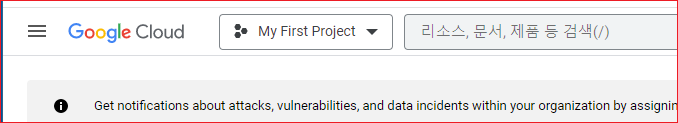
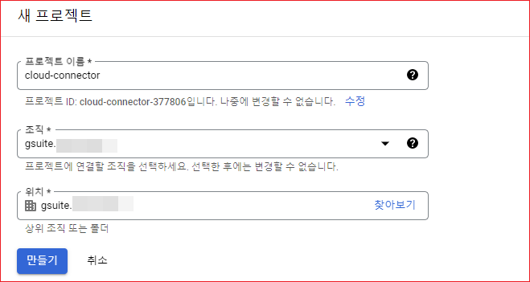
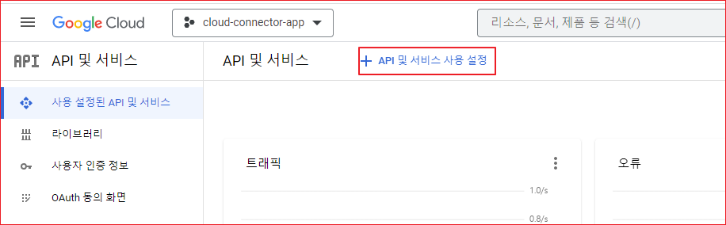
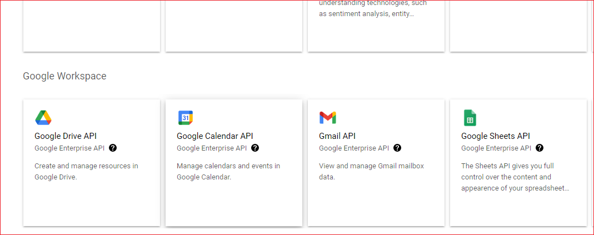
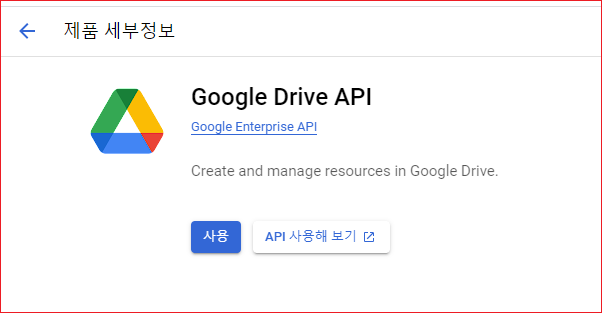

# 프로젝트 생성 

구글 API를 사용하려면 APP을 등록해야 하는데 먼저 프로젝트를 생성해야 합니다.  왼쪽 상단의 Google Cloud 옆에 My First Project를 클릭합니다. 

Default 프로젝트인 My First Project가 목록에 보이고, 추가로 생성한 프로젝트가 있으면 목록에 표시 될 것입니다. 

새프로젝트를 클릭합니다.  프로젝트 이름을 입력합니다. 조직을 선택합니다. 구글 워크스페이스를 사용하고 있지 않으면 "조직 없음"이라고 표시될 것입닏.ㅏ 

다시, My First Project를 클릭하면 방금 생성한 프로젝트가 보일 것입니다. 클릭하면 선택한 프로젝트가 작업 범위가 됩니다. 

## API 사용 설정

구글 클라우드 API를 사용하려면 사용하려는 API에 대한 사용 설정을 해야 합니다. 

"API 및 서비스 사용 설정"을 클릭합니다. 

Google Drive API를 클릭합니다. 

"사용"을 클릭합니다. 

같은 방법으로 Calendar, Gmail 등을 사용할 수 있도록 설정합니다. 

