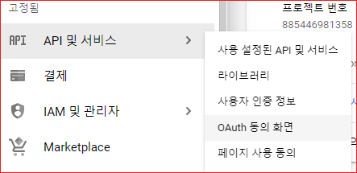
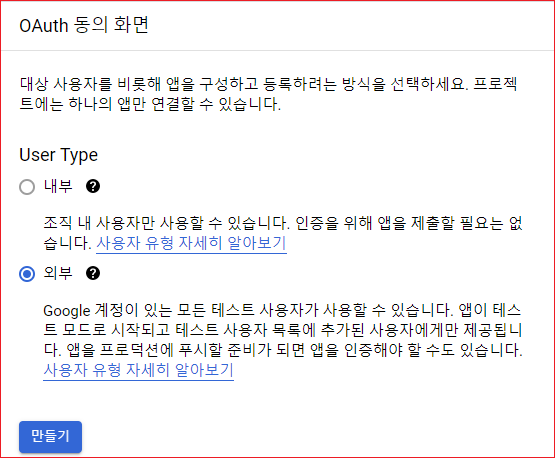
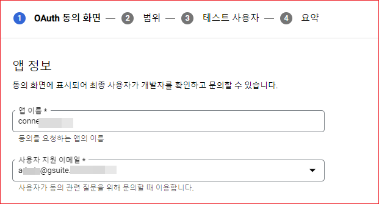
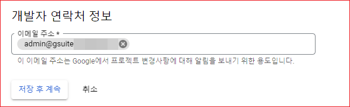
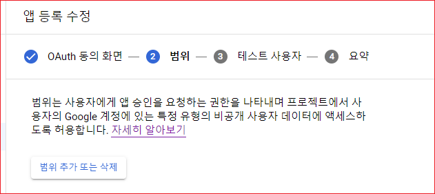
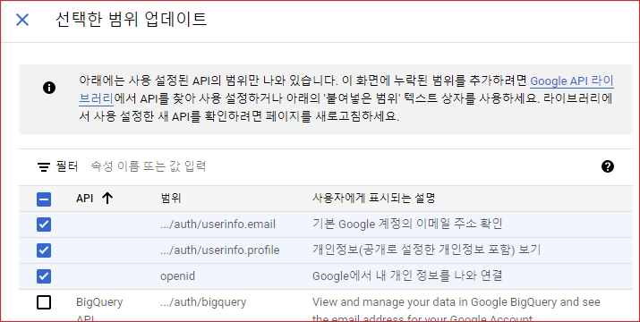
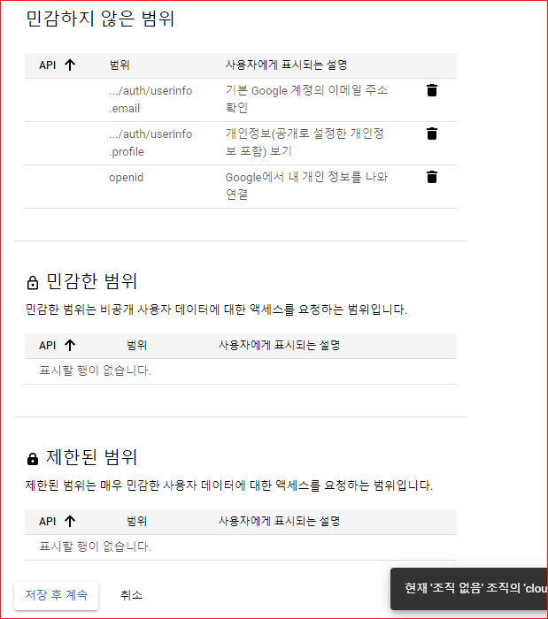
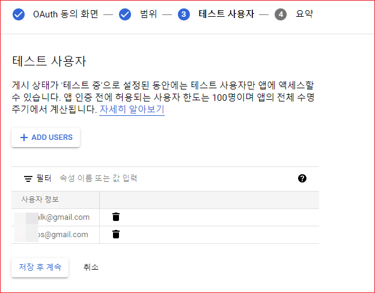
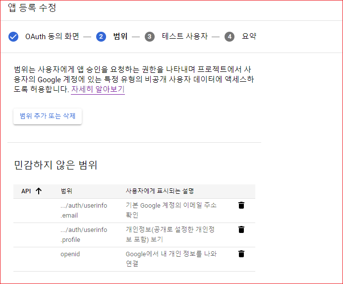
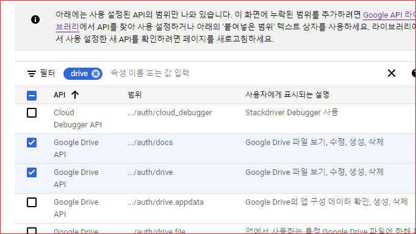

# OAuth 동의화면 

OAuth2 동의화면은 사용자가 구글에 로그인 시 서비스를 제공하는 앱이 사용자의 어떤 데이터에 접근하는지 표시하고 동의를 구하는데 사용됩니다. 

"API 및 서비스 \> OAuth 동의화면"을 선택합니다. 

## User Type
User Type에 "외부"를 선택합니다. 만들기를 클릭합니다. 

 

앱이름을 입력하고 사용자 지원 이메일을 입력합니다. 

 

나머지는 비워 둡니다.  개발자 연락처 정보를 입력합니다. 

 

"저장 후 계속"을 클릭합니다. 

## 범위 

"범위 추가 또는 삭제"를 클릭합니다. 

다음 화면에서 우선  userinfo.email과 userinfo.profile, 그리고 openid를 선택합니다. 

맨 아래에 "업데이트" 버튼이 있습니다. 클릭합니다. 

선택한 범위에 따라거 민감하지 않은 범위, 민감한 범위, 제한된 범위에 범위가 표시됩니다. 

"저장 후 계속"을 클릭합니다. 

## 테스트 사용자 

"Add Users"를 클릭하여 테스트 사용자 이메일을 입력합니다.  

> 테스트 중에는 등록된 사용자만 테스트를 할 수 있습니다. 

"저장 후 계속"을 클릭합니다. 

요약 정보가 표시됩니다.  맨 아래에 "대시보드로 돌아가기"를 클릭합니다. 

## 범위 수정
OAuth 동의 화면을 등록 한 후에 범위를 수정해야 할 일이 있습니다.  OAuth 동의화면을 클릭한 다음, "앱 수정을" 클릭합니다. 

범위 추가 및 삭제를 클릭합니다. 

필터에 "drive"라고 입력합니다. 그러면 drive와 관련된 권한이 필터되어 목록에 표시됩니다.  적용하려는 권한을 선택합니다. 

맨 아래의 "업데이트" 버튼을 클릭합니다. 

그런다음, 계속 "저장 후 계속"을 클릭하여 저장합니다. 

