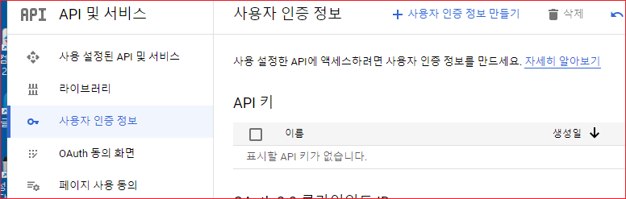
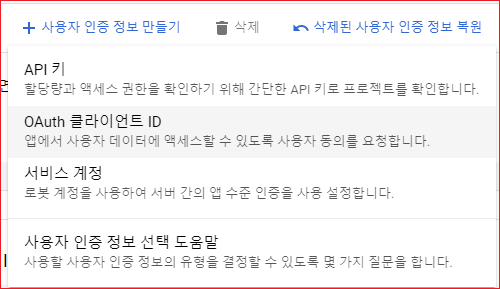
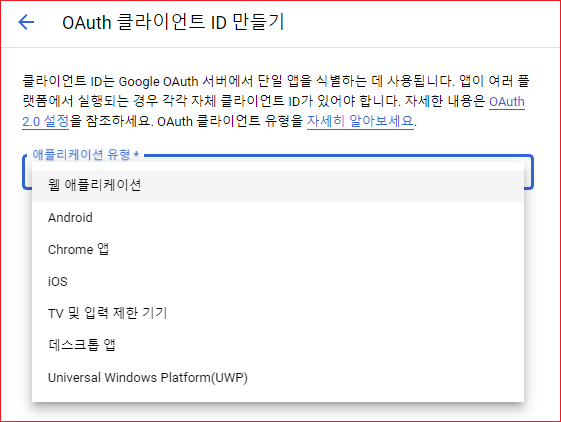
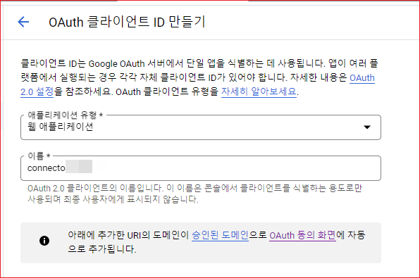
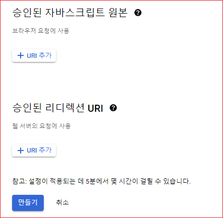
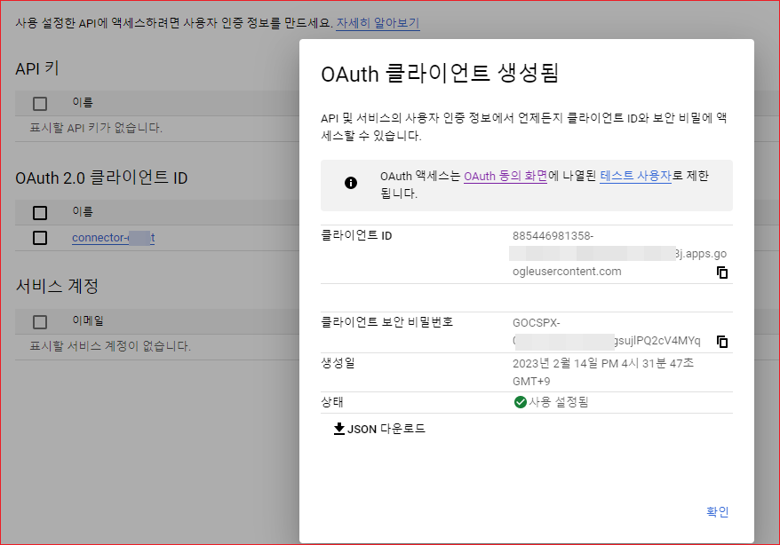

# OAuth 클라이언트 ID 생성

OAuth 클라이언트 ID와 클라이언트 보안 비밀 번호는 OAuth 인증 후 사용자를 대신하여 사용자의 자원에 접근할 경우 필요합니다. 

## 사용자 인증정보 만들기 

"사용자 인증 정보"를 클릭합니다. 아래 화면이 표시됩니다. 

"사용자 인증 정보만들기"를 클릭합니다. 

다음 화면에서 "OAuth 클라이언트 ID"를 클릭합니다. 

애플리케이션 유형을 "웹 애플리케이션"을 선택합니다. 

이름을 입력합니다. 

승인된 리디렉션 URI와 승인된 자바스크립트 원본은 여기서는 일단 생략합니다. 

 

만들기를 클릭합니다. 

생성된 OAuth 클라이언트 정보가 표시됩니다. 

 

