# 서비스 계정(Service Account) 생성 

서비스 계정은 사람이 아닌 Compute Engine 가상 머신(VM) 인스턴스와 같은 컴퓨팅 워크로드 또는 애플리케이션에서 사용하는 특별한 종류의 계정입니다. 서비스 계정은 계정에 고유한 이메일 주소로 식별됩니다. 서비스 계정에는 암호가 없으며 브라우저나 쿠키를 통해 로그인할 수 없습니다. 

서비스 어카운트는 구글 워크스페이스를 사용해야 생성이 가능합니다. 

"사용자 인증 정보"를 클릭합니다. "사용자 인증 정보 만들기"를 클릭합니다. "서비스 계정"을 클릭합니다. 


## 서비스 계정 생성 

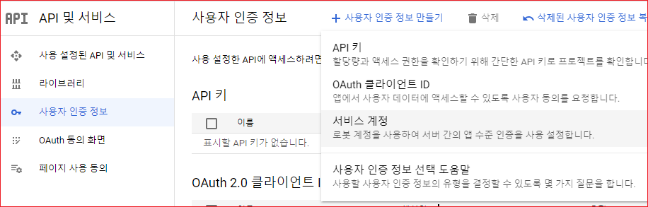


"서비스 계정 이름"을 입력합니다.  "서비스 계정 ID"는 자동 생성됩니다. 

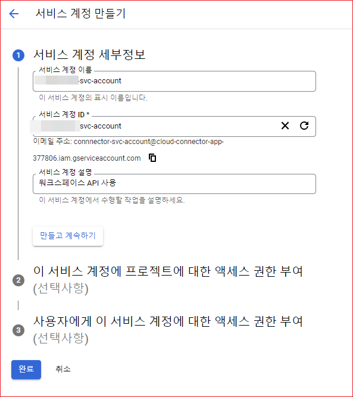


"완료"를 클릭합니다. 

"사용자 인증 정보" 화면에 생성된 서비스 계정이 목록에 표시됩니다. 

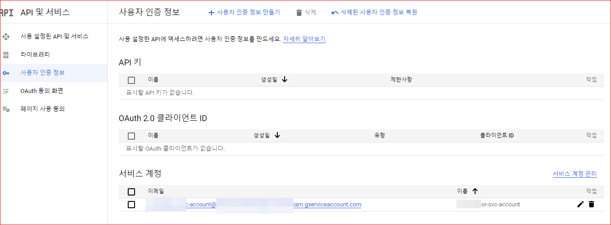


## 키 생성 
서비스 어카운트를 사용하려면 키를 생성해야 합니다. 생성된 키를 클래스 경로에 저장합니다. Google Sercie API를 사용하려면 GoogleCredential 클래스의 인스턴스를 생성해야 하는데, 인스턴스를 생성할 때 키 파일이 필요합니다. 

"키" 탭을 선택합니다.  "키 추가"를 선택합니다. 

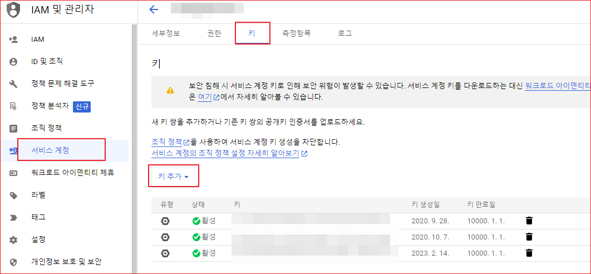 

"새 키 만들기"를 선택합니다. 

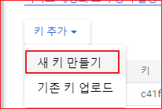 

"p12"를 선택하고 만들기를 선택합니다. 

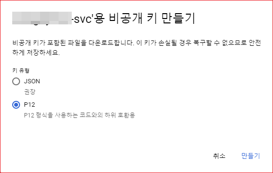 


"비공개 키가 컴퓨터에 저장됨" 화면이 표시됩니다. "닫기"를 선택합니다. 비공개키가 다운로드됩니다. 이 파일을 복사하여 클래스 패스에 추가합니다. 

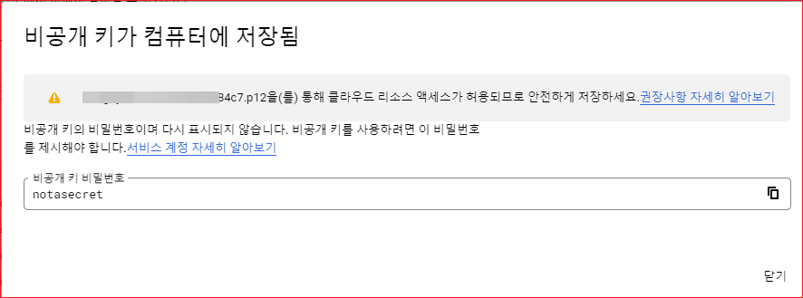

> 비공개키 파일을 분실하면 새로 생셩해야 합니다. 다시 받는 방법은 없습니다. 


## 도메인 전체 위임 

[구글 워크스페이스 관리콘솔 http://admin.google.com](https://admin.google.com)에 로그인합니다. 


보안 \> 엑세스 및 데이터 관리 \> API 관리를 클릭합니다. 

하단에 "도메인 전체 위임 관리"를 클릭합니다. 


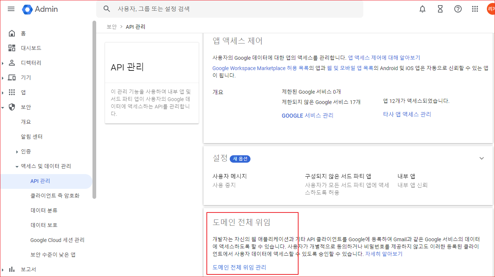

이미 등록된 클라이언트들이 목록에 표시됩니다. 

"새로 추가"를 클릭합니다. 

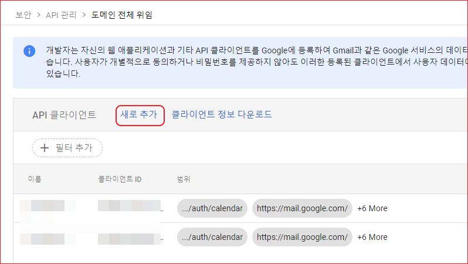


클라이언트 ID에 생성한 OAuth2 클라이언트 ID를 입력합니다.  권한에 다음을 추가합니다. 아래 권한은 구글 드라이브와 캘린더에 접근하도록 허용합니다. 

```shell
https://www.googleapis.com/auth/drive
https://www.googleapis.com/auth/calendar
```
> 권한에 대한 자세한 내용은 [OAuth 2.0 Scopes for Google APIs](https://developers.google.com/identity/protocols/oauth2/scopes)을 참고합니다. 

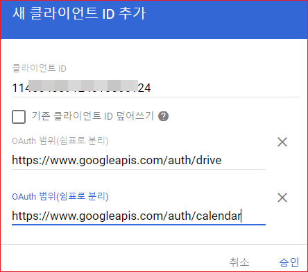

생성된 클라이언트가 목록에 표시됩니다.  권한은 나중에라도 "수정"을 클릭하여 수정할 수 있습니다. 

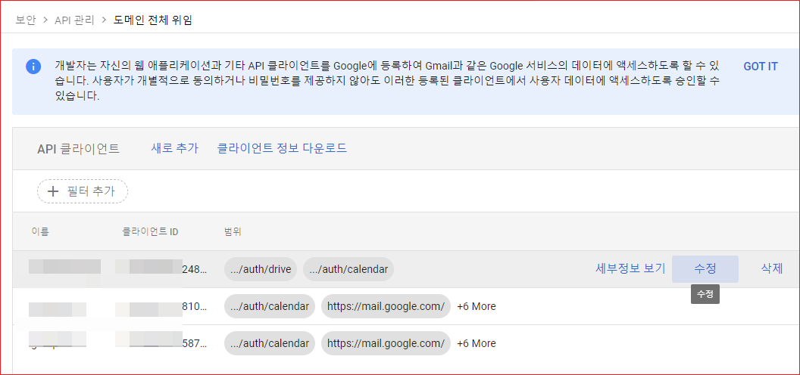


## 참고
[서버 간 애플리케이션에 OAuth 2.0 사용](https://developers.google.com/identity/protocols/oauth2/service-account?hl=ko#delegatingauthority) 


