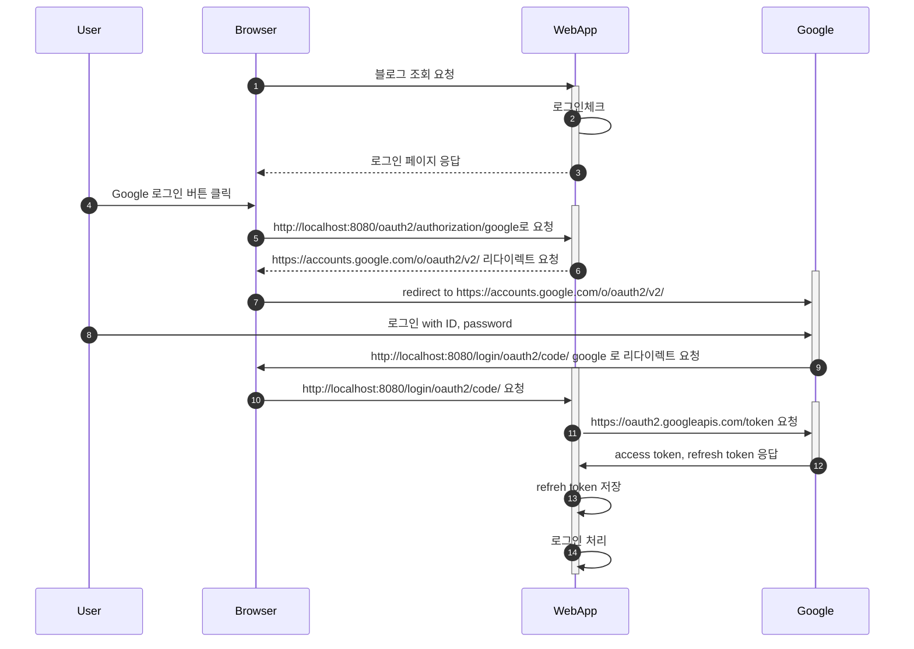
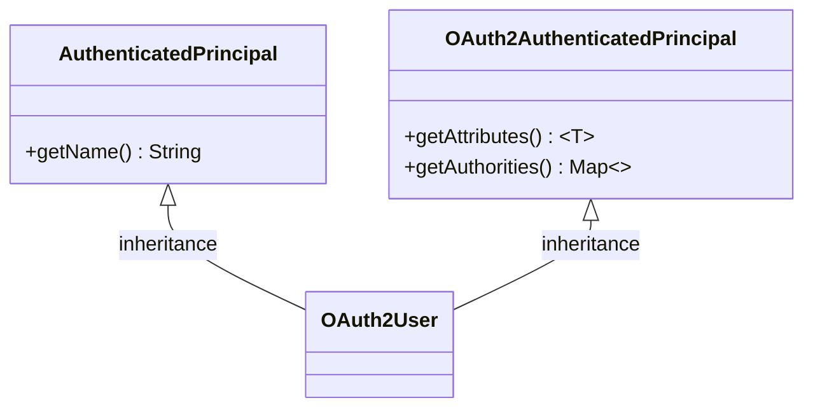
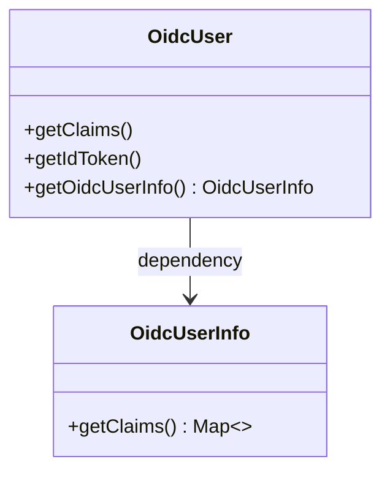

# Google OAuth2 로그인 

아래 시퀀스 다이어그램은 OAuth2 인증 흐름을 나타냅니다.  사용자가 웹 애플리케이션에 접근하면, 웹 애플리케이션은 사용자를 인증 서버에 리다이렉트합니다. 인증 서버는 사용자에게 로그인을 요청하고, 사용자에게 애플리케이션에 대한 액세스 권한을 요청합니다. 사용자가 애플리케이션에 대한 액세스 권한을 승인하면, 사용자가 로그인을 완료하면 사용자를 웹 애플리케이션으로 리다이렉트합니다. 웹 애플리케이션은 사용자가 로그인한 것을 확인하고,  인증 서버는 웹 애플리케이션에 액세스 토큰을 제공합니다. 웹 애플리케이션은 액세스 토큰을 사용하여 사용자의 정보를 가져옵니다. 


**인증 흐름**    



## 의존성 추가
Spring Security를 이용하여 OAuth2 인증을 지원하려면 다음 두 개의 의존성을 추가합니다. 

```xml
<!-- Spring Security -->
<dependency>
    <groupId>org.springframework.boot</groupId>
    <artifactId>spring-boot-starter-security</artifactId>
</dependency>

<!-- Google 등 OAuth2 Login-->
<dependency>
    <groupId>org.springframework.boot</groupId>
    <artifactId>spring-boot-starter-oauth2-client</artifactId>
</dependency>
```        


## 설정 

구글 OAuth2 로그인을 위한 링크를 설정하려면 applicaion.yml에 spring.security.oauth2.client.registration에 provider에 정보를 입력합니다. 

**application.yml**    
```yaml
spring:
  security:
    oauth2:
      client:
        registration:
          github:
            clientId: github-client-id
            clientSecret: github-client-secret
          google:
            client-id: google-client-id
            client-secret: google-client-secret
```

위 구성 파일에는 google과 github 두 개의 프로바이더를 등록했습니다.  client-id와 client-secret은 구글과 깃허브에서 발급받은 정보를 입력합니다.  Spring Security OAuth2 Client의 기본 Provider(google, facebook, github, okta)가 제공되므로 authorization-grant-type, redirect-uri, client-name 등을 지정하지 않아도 됩니다. 


## 로그인 링크 만들기

login.html에 로그인 링크를 만듭니다.  /oauth2/authorization/ URL은 Spring Security에서 제공하는 기본 링크입니다. 이 URL에 프러바이드 아이디를 추가합니다. 프러바이드 아이디는 application.yml에 등록한 아이디입니다. 즉, /oauth2/authorization/google은 구글 로그인을 의미합니다. 

사용자가 이 링크를 클릭하면 구글 로그인 페이지로 리다이렉트 됩니다. 구글의 경우, 'https://accounts.google.com/o/oauth2/v2/' 입니다. 


**login.html**    
```html
<div class="container unauthenticated">
  <div>
    With GitHub: <a href="/oauth2/authorization/github">click here</a>
  </div>
  <div>
    With Google: <a href="/oauth2/authorization/google">click here</a>
  </div>
</div>
```


## 사용자 정보 처리
OAuth2 로그인 시, 사용자가 로그인 후에 사용자 정보를 얻기 위해 DefaultOAuth2UserService의 loadUser() 메서드에 위임합니다.  이 것을 사용하지 않고 커스텀 서비스를 만들어 사용자 정보를 얻고 로그인을 처리를 해야 합니다. 

OAuth2UserService를 구현하여 사용자 서비스를 정의합니다. OAuth2UserService의 OAuth2User loadUser(OAuth2UserRequest oAuth2UserRequest) 메서드는 서드파티에 사용자 정보를 요청할 수 있는 access token 을 얻고나서 실행됩니다. 

OAuth2 사용자 정보를 처리하기 위해서 OAuth2UserService를 구현합니다. 


```java
@RequiredArgsConstructor
@Service
public class CustomOAuth2UserService implements OAuth2UserService<OAuth2UserRequest, OAuth2User> {

    @Override
    public OAuth2User loadUser(OAuth2UserRequest userRequest) throws OAuth2AuthenticationException {
    }
}
```

OpenID Connect를 사용하는 경우에도 OAuth2UserService를 구현합니다. 다만 OAuth2UserService의 제네릭 타입이 OidcUserRequest, OidcUser로 차이가 있습니다. 

```java
@RequiredArgsConstructor
@Service
public class CustomOidcUserService implements OAuth2UserService<OidcUserRequest, OidcUser> {

    @Override
    public OidcUser loadUser(OidcUserRequest userRequest) throws OAuth2AuthenticationException {
    }
}
```

앞에서 정의한 두 개의 서비스 클래스의 인스턴스를 Spring Security에 등록합니다. 

```java
@EnableWebSecurity // Spring Security를 활성화 시킵니다.
@Configuration
public class WebSecurityConfig {
    @Bean
    @Order(SecurityProperties.BASIC_AUTH_ORDER - 1)
    public SecurityFilterChain filterStaticResources(HttpSecurity http) throws Exception {
        http.oauth2Login(oauth2 -> oauth2.userInfoEndpoint(userInfo -> 
            userInfo
              .userService(this.customOAuth2UserService()) // OAuth2UserService를 구현한 클래스를 설정한다.
              .oidcUserService(this.customOidcUserService); // OIDC 로그인
            )
       );
    }//:
}
```


### OAuth2 사용자 정보 얻기 
ClientRegistration 인스턴스는 OAuth2UserReqeust.getClientRegistration() 메서드로 얻을 수 있습니다. OAuth2UserService.loadUser()에 인자로 전달합니다.OAuth2 로그인 시에는 DefaultOAuth2UserService의 loadUser() 메서드에 위임합니다.


```java
@RequiredArgsConstructor
@Service
public class CustomOAuth2UserService implements OAuth2UserService<OAuth2UserRequest, OAuth2User> {
    @Override
    public OAuth2User loadUser(OAuth2UserRequest userRequest) throws OAuth2AuthenticationException {
        
        ClientRegistration clientRegistration = userRequest.getClientRegistration();
        
        OAuth2UserService<OAuth2UserRequest, OAuth2User> delegate = new DefaultOAuth2UserService();
        OAuth2User oAuth2User = delegate.loadUser(userRequest);
    }
}
```

OAuth2User.getAttributes()를 통해 OAuth2 로그인 시에 반환된 사용자 정보를 Map 형태로 받을 수 있습니다. 

```java
OAuth2UserService<OAuth2UserRequest, OAuth2User> delegate = new DefaultOAuth2UserService();
OAuth2User oAuth2User = delegate.loadUser(userRequest);

Map<String, Object> attributes = oAuth2User.getAttributes();
String name      = (String) attributes.get("name"),
String email    = (String) attributes.get("email"),
String picture  = (String) attributes.get("picture");
```                
사용자 정보를 획득하였으면, 이를 토대로 가입 및 정보수정, 세션 저장 등의 기능을 구현하면 됩니다. 


아래 클래스 다이어그램은 OAuth2User 클래스의 상속 구조를 보여줍니다. 




### OpenID Connect 
OpenID Connect를 사용하는 경우 사용자 정보를 요청해야 합니다.  로그인이 성공한 이후에 userInfo endpoint로 사용자에 대한 정보를 요청합니다.  

**사용자 정보 로드**     
UserInfo 엔드포인트(구글의 경우 https://openidconnect.googleapis.com/v1/userinfo)는 인증된 최종 사용자에 대한 클레임을 반환하는 OAuth 2.0 보호 리소스입니다. 최종 사용자에 대한 요청된 클레임을 얻기 위해 클라이언트는 OpenID Connect 인증을 통해 얻은 액세스 토큰을 사용하여 UserInfo 엔드포인트에 요청합니다. 이러한 클레임은 일반적으로 클레임에 대한 이름 및 값 쌍의 컬렉션을 포함하는 JSON 개체로 표시됩니다.


OpenId Connect를 사용하고 UserInfo 엔드 포인트에 요청하기 위해서는 OidcUserRequest를 사용하는데  ClientRegistration 정보가 필요합니다. ClientRegistration 인스턴스를 생성하고 OidcUserRequest 생성자에 전달합니다. 

```java
@Override
public OidcUser loadUser(OidcUserRequest userRequest) throws OAuth2AuthenticationException {
    ClientRegistration clientRegistration = ClientRegistration
            .withClientRegistration(userRequest.getClientRegistration())
            .userNameAttributeName("sub")
            .build();

    OidcUserRequest oidcUserRequest = new OidcUserRequest(
           clientRegistration
         , userRequest.getAccessToken()
         , userRequest.getIdToken()
         , userRequest.getAdditionalParameters());
    // ...생략 
}
``` 

DefaultOidcUserService의 loadUser() 메서드에 위임합니다. 위에서 생성한 OidcUserRequest를 인자로 전달합니다.사용자 정보를 로드하기 위해서 위임 기반 전략을 사용합니다.  
```java
@RequiredArgsConstructor
@Service
public class CustomOidcUserService implements OAuth2UserService<OidcUserRequest, OidcUser> {
    @Override
    public OidcUser loadUser(OidcUserRequest userRequest) throws OAuth2AuthenticationException {
        //... 생략 
        OAuth2UserService<OidcUserRequest, OidcUser> delegate = new DefaultOidcUserService();
        OidcUser oidcUser = delegate.loadUser(userRequest);
    }
}
```


아래 클래스 다이어그램은 OidcUSer와 OidcUSerInfo의 관계를 보여줍니다. 




UserInfo 엔드포인트에서 반환하는 사용자 정보는 다음과 같은 형태이다. 

```json
{
  "sub": "110169484474386276334",
  "name": "홍길동",
  "given_name": "길동",
  "family_name": "홍",
  "profile": "https://plus.google.com/110169484474386276334",
  "picture": "https://lh3.googleusercontent.com/-kYgzyAWpZzY/AAAAAAAAAAI/AAAAAAAAAAA/425Mq4v5hSg/photo.jpg",
  "email": "
```

OidcUser인 경우에는 getClaims()를 사용하여 사용자 정보를 Map 형태로 받을 수 있습니다. 

```java
        Map<String, Object> attributes = oidcUser.getClaims();
        System.out.println("Id Token:" + oidcUser.getIdToken());
        // Id Token:org.springframework.security.oauth2.core.oidc.OidcIdToken@18c4aa01
        Map<String, Object> attributes = oidcUser.getClaims();
        attributes.forEach((k, v) -> {
            System.out.println(k + ":" + v);
        });
        // 출력된 정보
        // at_hash:UX7FOfXTC45dqomxV3o4eKg
        // sub:986690764843726136643
        // email_verified:true
        // iss:https://accounts.google.com
        // given_name:jihoon
        // locale:ko
        // nonce:8mWALrPLDFQM6grYMDc_hcllc4KJvBPh0-2INkaTHCY
        // picture:https://lh3.googleusercontent.com/a/AEdFTp4UGpzcxuuMCRgtT99XP5T1IpfXPI-bq9t7sfRA=s96-c
        // aud:[123456679076-sm8rp0rvvmjpcdfesgf88d9bciv2vtr5.apps.googleusercontent.com]
        // azp:123456679076-sm8rp0rvvmjpcdfesgf88d9bciv2vtr5.apps.googleusercontent.com
        // name:User1 Kim
        // exp:2023-02-06T09:55:05Z  // 유효시간, 1시간 
        // family_name:Parkm
        // iat:2023-02-06T08:55:05Z  // 발급시간
        // email:user1@gmail.com        
```


### userNameAttributeName

OAuth2에서 userNameAttributeName은 OAuth2 인증 서버에서 인증된 사용자
(end-user)의 이름 또는 식별자(identifier)를 참조하는 UserInfo Response에서 반환된 속성의 이름입니다. OAuth2 로그인 시 키 값이 됩니다. 

* Google : sub
* Naver : response
* Kakao : id


IDP 마다 다른 키 값을 사용하기 때문에 이를 구분하기 위해 providerDetails.userInfoEndpoint.userNameAttributeName 을 
사용합니다.

```java
String userNameAttributeName = oAuth2UserRequest.getClientRegistration()
       .getProviderDetails()
       .getUserInfoEndpoint().getUserNameAttributeName();
```        


## 기본제공 되지 않는 프로바이더
기본 제공 되지 않는 Provider를 사용하려면 spring.security.oauth2.client.provider에 Provider를 등록해야 하고, Registration 정보를 설정해야 합니다. 예를 들어 Azure AD를 사용하려면 다음과 같이 application.yml에 설정합니다. 


```yaml
spring:
  security:
    oauth2:
      client:
        # OAuth 클라이언트 등록 정보
        # Spring Security OAuth2 Client의 기본 Provider 가 아닌경우  redirect-uri를 지정해야 한다. 
        registration:
          google:
            client-id: <client-id>
            client-secret: <client-secret>
          azure:
            # OAuth2 인증 grant type 을 설정
            authorization-grant-type: authorization_code
            # OAuth2 client-id
            client-id: '<client-id>'
            # OAuth2 client-secret
            client-secret: '<client-secret>'
            # OAuth2 client name
            client-name: '<your-client-name>'
            # OAuth2 redirect-uri
            redirect-uri: 'http://{site_url}/login/oauth2/code/azure'
            # OAuth2 scope
            scope: openid,email
        # OAuth2 Provider 등록 정보
          # Spring Security OAuth2 Client의 기본 Provider(google, facebook, github, okta)은 설정되어 있어 추가하지 않아도 된다.
        provider:
          azure:
            # ODIC Provider의 /.well-known/openid-configuration endpoint
            issuer-uri: 'https://login.microsoftonline.com/0f298de5-864d-4f37-9497-77ace3386e9e/v2.0'
            #  ODIC를 지원하지 않는 Provider는 아래설정을  추가해야 한다.
#            authorization-uri: 'https://login.microsoftonline.com/0f298de5-864d-4f37-9497-77ace3386e9e/oauth2/v2.0/authorize'
#            token-uri: 'https://login.microsoftonline.com/0f298de5-864d-4f37-9497-77ace3386e9e/oauth2/v2.0/token'
#            user-info-uri: 'https://graph.microsoft.com/oidc/userinfo'
#            user-name-attribute: 'sub'
```


## Principal
OAuth2에서 보안 주체는 일반적으로 사용자인 리소스에 대한 액세스를 요청하는 엔터티입니다. 체는 사용자 이름 및 암호와 같은 인증 메커니즘으로 식별되며 사용자를 설명하는 속성 또는 클레임 ​​집합으로 표현됩니다. 보안 주체는 사용자가 액세스할 수 있는 리소스를 결정하고 해당 리소스와 연결된 액세스 제어 정책을 시행하는 데 사용됩니다.


## 더 알아 보기
* [Spring Security and OpenID Connect](https://www.baeldung.com/spring-security-openid-connect) 
    * [Source](https://github.com/eugenp/tutorials/tree/master/spring-security-modules/spring-security-oidc) 
* [Google OpenID Connect](https://developers.google.com/identity/openid-connect/openid-connect?hl=ko)   

