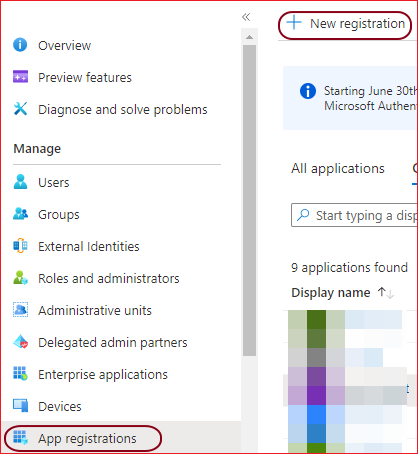
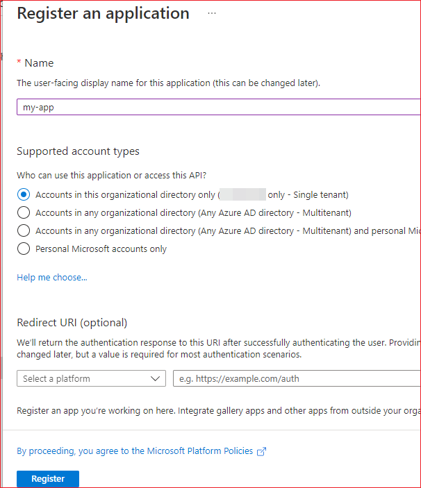
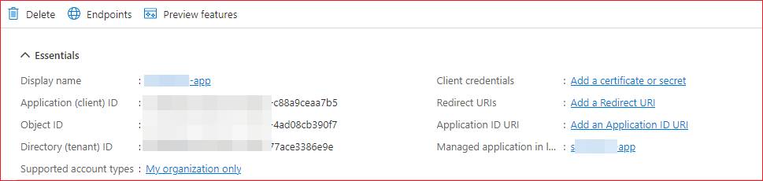
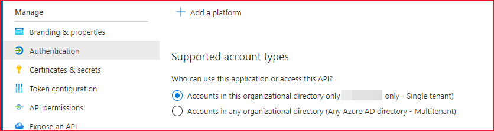
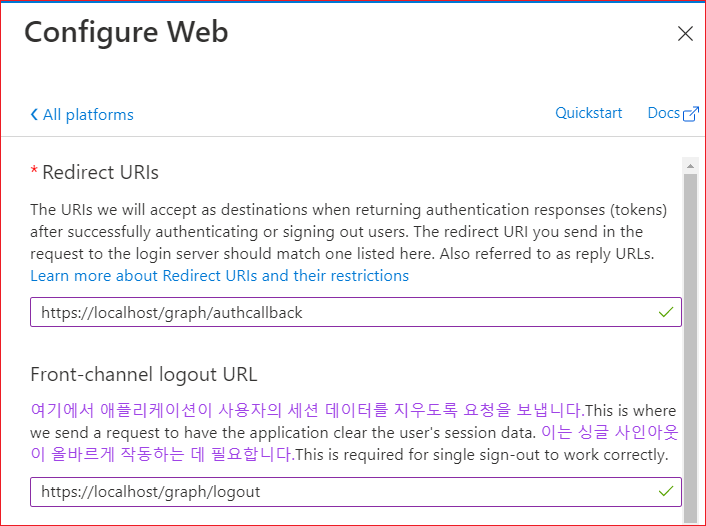
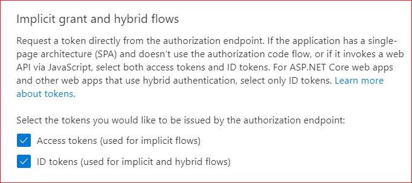
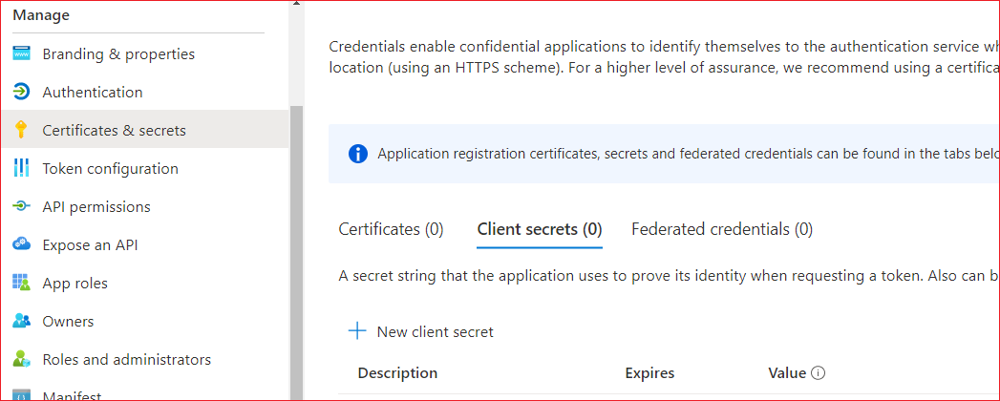
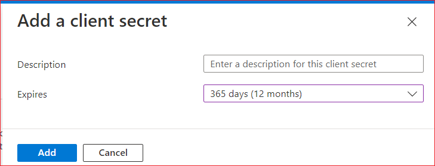
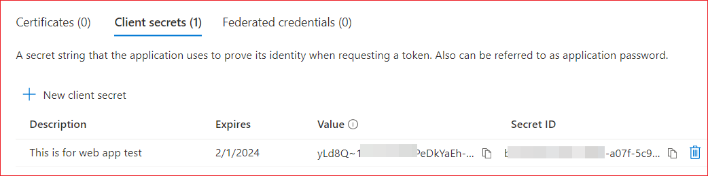

# 앱 등록

Graph API는 OAuth2 프로토콜을 사용하여 사용자를 인증합니다.  이 글의 내용은 [빠른 시작: 웹앱에 Microsoft로 로그인 추가](https://learn.microsoft.com/ko-kr/azure/active-directory/develop/web-app-quickstart?pivots=devlang-java)을 참고로 하여 작성했습니다. 


다음의 순서대로 앱을 생성하고 구성합니다. 
1. New Registration을 선택하여 앱을 등록합니다.
2. Authentication을 선택하여 Platform을 Web으로 선택하고 Redirect URIs를 등록하고 인증 엔드포인트인 Access Tokens과 ID Tokens을 선택합니다. 
3. Certificates & secrets를 선택하여 Client Secrets를 생성합니다. 
4. API Permissions을 선택하여 App에 권한을 부여합니다. 


## 앱 등록
Azure Portal에서 앱을 등록해야 합니다.  좌측 메뉴에서 App Registrations을 선택하고 New Registration을 클릭합니다. 





원하는 앱의 이름을 입력합니다. Redirect URL은 비워둡니다. 나중에 다시 구성할 수 있고 OAuth2.0 구성에서 생성된 리디렉션 URI을 추가합니다. "Register" 버튼을 클릭합니다. 




앱을 등록하고 나면 앱의 정보가 표시됩니다. 

  


## Platform 구성

좌측 네비게이션의 Manage 아래에 Authentication을 클릭합니다.  Supported account types에 Single tanant를 선택합니다(default).



Platform configurations의 Add a platform을 클릭합니다. Web Applications Web을 클릭합니다. Platform은 Web, Single-page application, IOS/macOS, Android 등이 있습니다. Web App을 개발하는 것으로 가정하기 때문에 여기서는 Web을 선택합니다. 


### Redirect URIs

Redirect URIs에 사용자를 성공적으로 인증하거나 로그아웃한 후 인증 응답(토큰)을 반환할 때 대상으로 허용되는 URI를 입력합니다.  로그인 서버에 대한 요청에서 보내는 리디렉션 URI는 여기에 나열된 것과 일치해야 합니다. 회신 URL이라고도 합니다. 


Front-end logout URI에 애플리케이션이 사용자의 세션 데이터를 지우도록 요청을 보내는 URI를 입력합니다. 이는 싱글 사인아웃이 올바르게 작동하는 데 필요합니다.

Spring Security를 사용하는 경우에는 /login/oauth2/code/azure가 URL에 포함되어 있어야 합니다. 다음과 같이 입력합니다. 

```shell
https://{site}/login/oauth2/code/azure
```


 


"Implicit grant and hybrid flows"에서 토큰을 선택합니다. 권한 부여 끝점에서 직접 토큰을 요청합니다. 애플리케이션에 SPA(단일 페이지 아키텍처)가 있고 인증 코드 흐름을 사용하지 않거나 JavaScript를 통해 웹 API를 호출하는 경우 **액세스 토큰과 ID 토큰을 모두 선택**합니다. ASP.NET Core 웹앱 및 하이브리드 인증을 사용하는 기타 웹앱의 경우 ID 토큰만 선택합니다

둘 다 선택합니다.

 


### Client Secrets 생성

하단에 Configure 버튼을 클릭합니다. 


Manage 아래의 Certificates & Secrets를 선택합니다.  New Client secret를 클릭합니다. 





Descriptions을 입력하고 Expires를 선택합니다. 




Add 버튼을 클릭합니다. 생성된 시크릿 정보가 표시됩니다. 



**Secrets를 생성했으면 Secrets의 Value 값은 복사해 둡니다. 나중에 이 값을 사용하는데 생성한 시점에는 볼 수 있지만, 나중에는 이 값을 볼 수 없습니다.** 


## 참고

[Authorization and privileges](https://learn.microsoft.com/en-us/graph/api/resources/users?view=graph-rest-1.0)