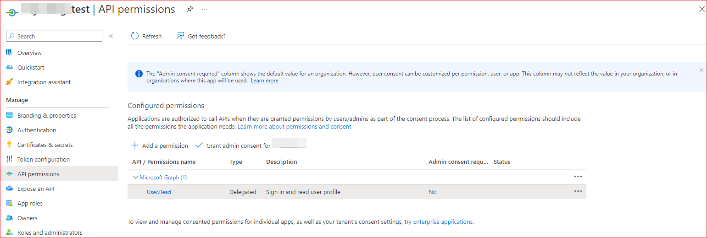
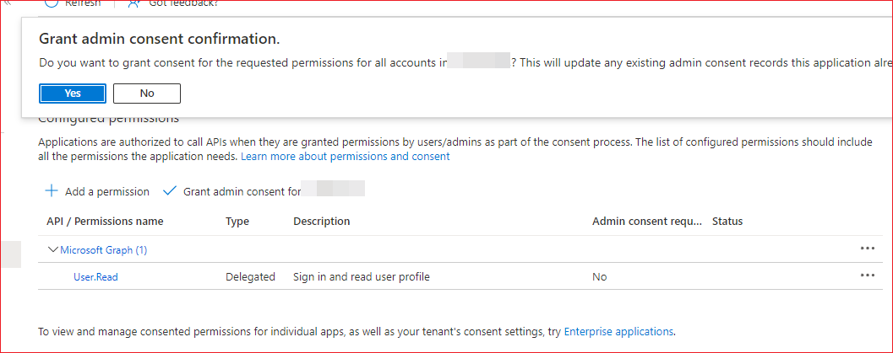
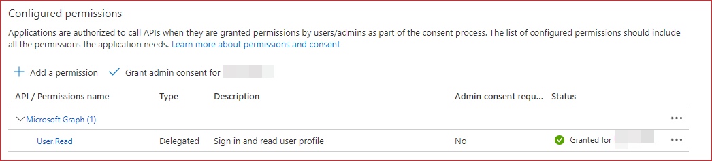
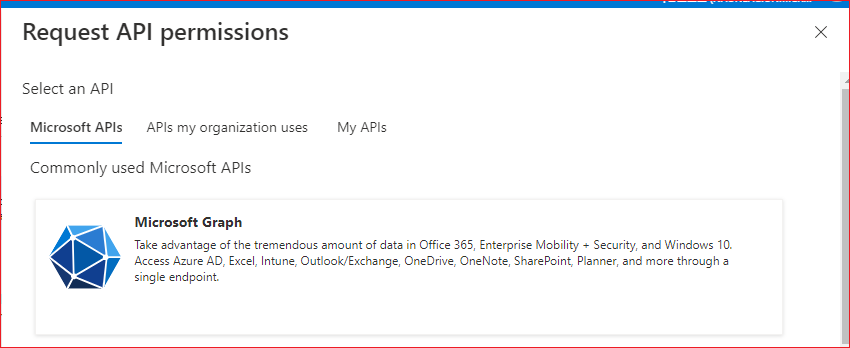
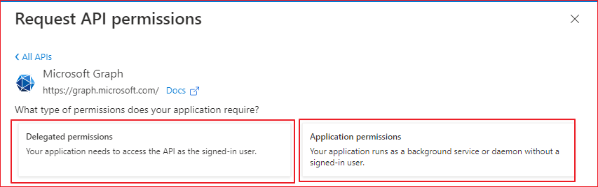
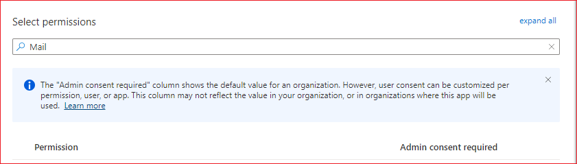
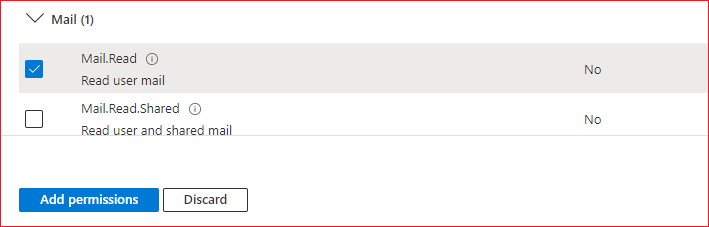
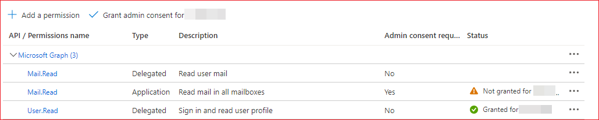
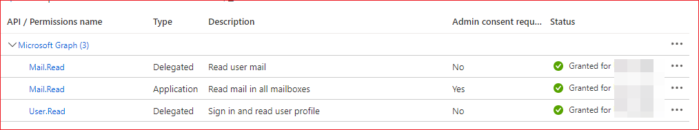

# Permissions 등록

처음 앱을 등록하고 나면 다음과 같이 User.Read 퍼미션만 부여되어 있습니다.  App이 Graph API를 사용하려면 여기서 필요한 권한을 부여 해야 합니다. 

Microsoft Graph를 호출하는 방법에는 두 가지가 있습니다. 일부 앱은 사용자를 대신하지 않고 자체 ID로 Microsoft Graph를 호출합니다. 다른 하나는 사용자를 대신하여 Microsoft Graph를 호출합니다.

* 사용자를 대신하여 엑세스하기
* 사용자 없이 엑세스하기

사용자를 대신하여 Graph를 호출하는 것은 사용자의 권한을 기준으로 API를 호출할 때 유용합니다. 사용자 없이 Graph를 호출하는 앱들은 대부분의 경우 로그인한 사용자 없이 서버에서 실행되는 백그라운드 서비스 또는 데몬입니다.

위 그림에서 API / Permissions name에 보면 User.Read 권한이 부여되어 있습니다. Type에 Delegated로 되어 있는데 이것은 "사용자를 대신하여 액세스하기" 유형입니다. 만일에 사용자 없이 액세스하려면 Application 타입으로 권한을 추가해야 합니다. 

앱이 사용자가 자신을 대신해 보호되는 리소스에 액세스할 때 동의 화면이 표시됩니다. 관리자 또는 사용자에게 조직/개인 데이터에 대한 엑세스를 허용하도록 동의를 요청할 수 있습니다. 

Azure Portal을 통한 관리자 동의를 하면 관리자는 테넌트의 모든 사용자를 대신하여 위임된 권한을 포함할 수 있는 애플리케이션이 요청하는 모든 권한에 동의합니다.

위 그림에서 Status에 아무것도 표시되어 있지 않습니다.  아직 관리자에 대한 동의가 구성되지 않았습니다.  관리자 동의를 할 수 있도록 구성해 보겠습니다. 

"Grant admin consent for ...."를 클릭합니다. 

"Yes"를 선택합니다. 

그러면 아래 그림과 같이 Status에 "Granted for .."가 표시됩니다. 

## 메일 권한 추가 
사용자의 메일 읽기를 하려면 "Add permission"을 선택합니다.  Microsoft Graph를 선택합니다. 

사용자를 대신하여 엑세스하로도록 하려면 Delegated permissions을 선택합니다. 사용자 없이 액세스하도록 하려면 Applicaiton permissions을 선택합니다. 먼저 Delegted를 선택할 것입니다.  Application permissions도 동일한 방법으로 퍼미션을 부여하면 됩니다. 

퍼미션을 필터링하도록 Select permissions에 Mail이라고 입력합니다. 

Mail 옵션을 확장합니다. Mail.Read를 선택합니다. Add permissions을 클릭합니다. 

Application permissions도 동일한 방법으로 퍼비션을 추가합니다. 아래 그림과 같이 추가된 퍼미션 목록이 표시됩니다.

"Grant adminconsent for .."을 선택하고 Yes를 선택합니다. 

Status에 모두 "Granted for .."가 표시되는 것을 확인할 수 있습니다. 

필요한 권한이 있으면 위와 같은 방법으로 하면 됩니다. 

## 참고 
[Azure Active Directory의 애플리케이션에 대한 동의 환경](https://learn.microsoft.com/ko-kr/azure/active-directory/develop/application-consent-experience)     
