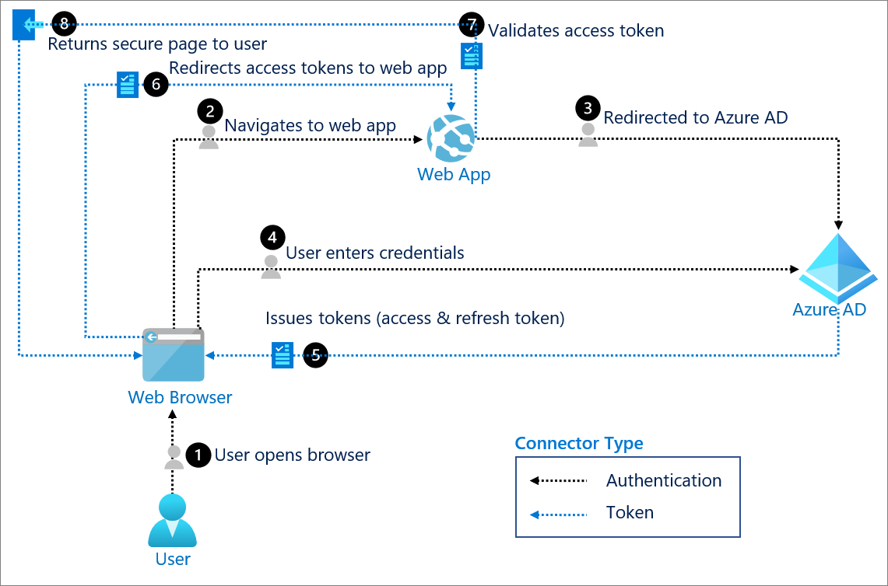

# Azure AD OAuth2 로그인 

Azure AD에 OAuth2를 사용하여 로그인하는 것은 구글과 다를 것이 없습니다. 이 글에서는 Azure AD의 차이점만 설명합니다. 자세한 사항은 [Google OAuth2 로그인](../../01.google/01.cloud-api/05.oauth2-login.md)을 참고하세요. 

Azure AD와 OAuth 2.0 인증을 하는 방법에 대해서 알아봅니다. 아래 그림은 Azure AD OAuth2 인증흐름을 설명하고 있습니다. 사실 OAuth2 인증 프로토콜은 구글이나 MS Azure AD 모두 동일한 방식입니다. 




##  Provider 구성 
Azure는 Spring Security 가 기본으로 제공하는 프로바이더가 아닙니다. 기본 제공 되지 않는 Provider를 사용하려면 spring.security.oauth2.client.provider에 Provider를 등록해야 하고, Registration 정보를 설정해야 합니다. 예를 들어 Azure AD를 사용하려면 다음과 같이 application.yml에 설정합니다. 

```yaml
spring:
  security:
    oauth2:
      client:
        # OAuth 클라이언트 등록 정보
        # Spring Security OAuth2 Client의 기본 Provider 가 아닌경우  redirect-uri를 지정해야 한다. 
        registration:
          google:
            client-id: <client-id>
            client-secret: <client-secret>
          azure:
            # OAuth2 인증 grant type 을 설정
            authorization-grant-type: authorization_code
            # OAuth2 client-id
            client-id: '<client-id>'
            # OAuth2 client-secret
            client-secret: '<client-secret>'
            # OAuth2 client name
            client-name: '<your-client-name>'
            # OAuth2 redirect-uri
            redirect-uri: 'http://{site_url}/login/oauth2/code/azure'
            # OAuth2 scope
            scope: openid,email
        # OAuth2 Provider 등록 정보
          # Spring Security OAuth2 Client의 기본 Provider(google, facebook, github, okta)은 설정되어 있어 추가하지 않아도 된다.
        provider:
          azure:
            # ODIC Provider의 /.well-known/openid-configuration endpoint
            issuer-uri: 'https://login.microsoftonline.com/0f298de5-864d-4f37-9497-77ace3386e9e/v2.0'
            #  ODIC를 지원하지 않는 Provider는 아래설정을  추가해야 한다.
#            authorization-uri: 'https://login.microsoftonline.com/0f298de5-864d-4f37-9497-77ace3386e9e/oauth2/v2.0/authorize'
#            token-uri: 'https://login.microsoftonline.com/0f298de5-864d-4f37-9497-77ace3386e9e/oauth2/v2.0/token'
#            user-info-uri: 'https://graph.microsoft.com/oidc/userinfo'
#            user-name-attribute: 'sub'
```


## 로그인 링크 생성하기 

login.html에 로그인 링크를 만듭니다.  /oauth2/authorization/ URL은 Spring Security에서 제공하는 기본 링크입니다. 이 URL에 프러바이드 아이디를 추가합니다. 프러바이드 아이디는 application.yml에 등록한 아이디입니다. 즉, /oauth2/authorization/azure 는 Azure 로그인을 의미합니다. 

```html
<div class="container unauthenticated">
  <div>
    With Azure: <a href="/oauth2/authorization/azure">click here</a>
  </div>
</div>
```

AzureAD로 리다이렉트되는 endpoint는 다음과 같습니다. Directory ID는 Azure portal의 등록한 앱의 Overview에서 찾을 수 있습니다.

```shell
https://login.microsoftonline.com/{directory(tenant) ID}/oauth2/authorize
```


