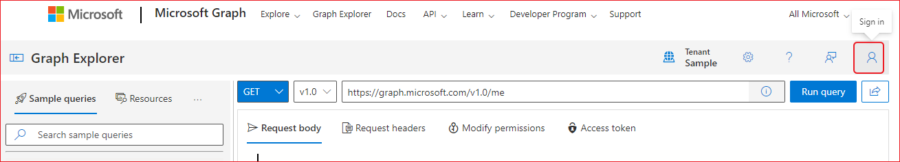
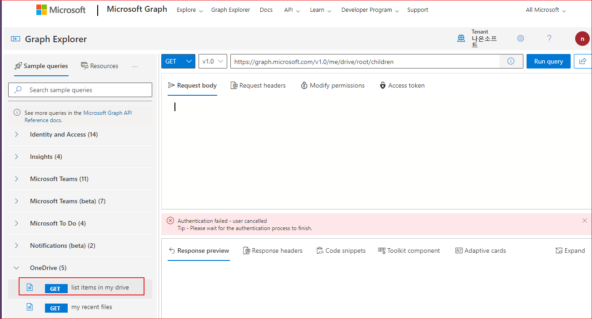
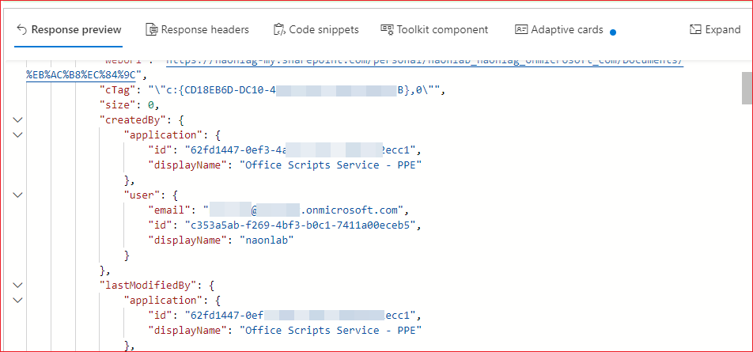

# Graph Explorer - Graph API Test

[https://developer.microsoft.com/en-us/graph/graph-explorer](https://developer.microsoft.com/en-us/graph/graph-explorer)를 사용하면 Graph API를 브라우저에서 테스트해 볼 수 있습니다. 

## 로그인 

Sign in 버튼을 클릭합니다. 

로그인 화면이 팝업됩니다. 아이디와 패스워드를 입력하여 로그입한니다.  스마트폰의 Microsoft Authenticator에서 로그인을 승인합니다. 

## API 테스트 
One drive에서 루트 폴더 아래의 디렉토리 및 파일을 가져와 보겠습니다. 좌측 네비게이션에서 OneDrive(5)를 클릭합니다. 

오른쪽 상단의 "Run query"를 클릭합니다.  그러면 아래 "Response preview" 섹션에 응답 결과가 표시됩니다. 

