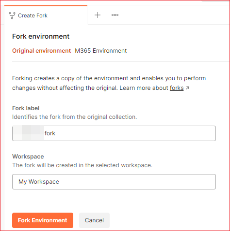

# Postman을 이용한 Graph API 테스트 

Postman을 이용하면 Graph API를 브라우저에서 테스트해 볼 수 있습니다  자세한 내용은 [Use Postman with the Microsoft Graph API](https://learn.microsoft.com/en-us/graph/use-postman)을 참고합니다. 

## Azure AD 앱 생성

1. [portal.azure.com](https://portal.azure.com)으로 이동하고 개발자 테넌트 관리자 계정으로 로그인합니다.
2. Azure Services Azure Active Directory를 선택합니다
3. 왼쪽 메뉴에서 앱 등록을 선택합니다.
4. 왼쪽 메뉴에서 App registrations을 선택합니다. 
5. 가로 메뉴에서 New registration을 선택합니다. 
6. dropdown menu에서 Web을 선택합니다. 
7. Redirect URI에 "https://oauth.pstmn.io/v1/browser-callback"을 설정합니다. 
8. Register를 선택합니다. 

9. 왼쪽 메뉴에서 API 권한을 선택합니다.
10. 가로 메뉴에서 Add a permission을 선택합니다. Microsoft Graph를 선택하고 Delegated Permissions을 선택합니다.

11. Mail을 타이핑하고, Mail Options을 확장하고, Mail.Read를 선택합니다. 

12. Appication permissions을 선택하고 User 옵션을 확장한 다음 User.Read.All을 선택한다. 

13. Add permissions을 클릭한다.

14. Grant admin consent for 을 선택하고 Yes를 클릭한다. 

15. Overview에서 Application(client) ID와 Directory(tenant)ID가 보인다. 나중에 필요하다. 

16. 왼쪽 메뉴에서 Certificates and secrets을 선택한다. 
17. New Client secret를 선택한다. 
18. Description을 입력하고 Add를 클릭한다. 

19. 생성된 Client secrets의 Value위에 마우스를 가져가서 복사한다. 나중에 볼 수 없으니 복사해 둔다. 

## Fork the Microsoft Graph Postman collection

[https://identity.getpostman.com/login](https://identity.getpostman.com/login) 사이트로 이동합니다. 

"Sign in with Google"을 클릭하여 로그인합니다.

상단의 "Search Postman"을 클릭하고 "Graph"를 입력하여 검색합니다. 

"Microsoft Graph"를 클릭합니다. 

왼쪽의 "Collection \> Microsoft Graph"를 클릭합니다. 

"Microsoft Graph" 탭을 클릭합니다.  더보기 매뉴을 클릭한 다음에 Create a fork를 선택합니다.

"Fork label"을 입력하고 "Fork Collection"을 클릭합니다. 

쉬운 방법으로는 [Microsoft Graph](https://www.postman.com/microsoftgraph/workspace/microsoft-graph/collection/455214-085f7047-1bec-4570-9ed0-3a7253be148c/fork)을 클릭하여 바로 fork할 수 있습니다. 

## Configure authentication

이 단계에서는 액세스 토큰을 검색하는 데 사용하는 Postman의 환경 변수를 설정합니다.

Workspace에서 My Workspace를 선택합니다. 

1. [Fork Environment](https://www.postman.com/microsoftgraph/workspace/microsoft-graph/environment/455214-efbc69b2-69bd-402e-9e72-850b3a49bb21/fork)로 이동합니다. 

2. label을 입력합니다. 
3. Forl environment를 선택합니다. 

4.  ClientID, TenantID, ClientSecret 변수들의 CURRENT VALUE에 Azuer에서 복사한 값들을 설정합니다. 

5. 오른쪽 위쪽에서 Save를 선택합니다. 
6. Manage Environments 탭을 닫습니다. 
7. 오른쪽 위쪽에서 눈 아이콘 옆의 드롭다운 메뉴를 선택하고 M365 Environment를 선택합니다. 

## Get a delegated access token

위임된 인증 흐름으로 요청을 실행하는 것은 이번이 처음이므로 액세스 토큰을 가져와야 합니다.

1. Delegated 폴더를 선택합니다. 
2. Authorization tab을 선택합니다. 
3. Configure New Token section에서 onfiguration Options tab을 선택합니다. 콜백 URL이 애플리케이션 등록을 생성할 때 제공한 것과 일치하는지 확인하십시오.모든 필드를 미리 구성된 상태로 두십시오. Grant type을 포함해서 입니다. 이것은 Authorization Code로 설정되어 있습니다. 

4. 스크롤 버튼을 내려서  Get New Access Token을 선택합니다. 
5. 개발자 테넌트 관리자 계정으로 로그인합니다.
6. 진행을 선택한 다음 Use Token 버튼을 선택합니다.

이제 위임된 요청에 사용할 유효한 액세스 토큰이 있습니다.

## Run your first delegated request

Delegated 폴더 안에는 호출할 수 있는 다양한 Microsoft Graph 워크로드에 대한 요청이 있습니다.

1. Delegated folder를 확장합니다.  Mail folder를 확장합니다. 
2. Get my messages를 선택합니다. 
3. 오른쪽 위에서 Send를 선택합니다. 

## Get an application access token

애플리케이션 인증 흐름으로 요청을 실행하는 것은 이번이 처음이므로 액세스 토큰을 가져와야 합니다.

1. Application Folder를 선택합니다. 
2. Authorization tab을 선택합니다. 
3. Configure New Token section에서, Configuration Options tab을 선택합니다. Grant Type을 포함하여 모든 필드를 미리 구성된 상태로 둡니다. 이는 Client Credentials 증명으로 설정됩니다.

4. Get New Access Token을 선택합니다. 
5. Proceed를 선택하고 Use Token button을 선택합니다. 

이제 애플리케이션 요청에 사용할 유효한 액세스 토큰이 있습니다.

## Run your first application request

1. Application folder을 확장하고 User folder를 확장합니다. 
2. Get Users을 클릭합니다.
3. Send을 선택합니다. 

