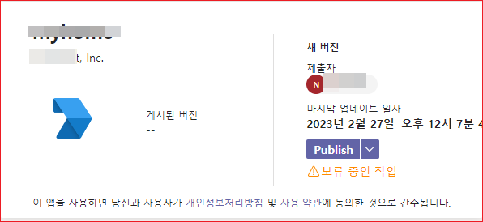
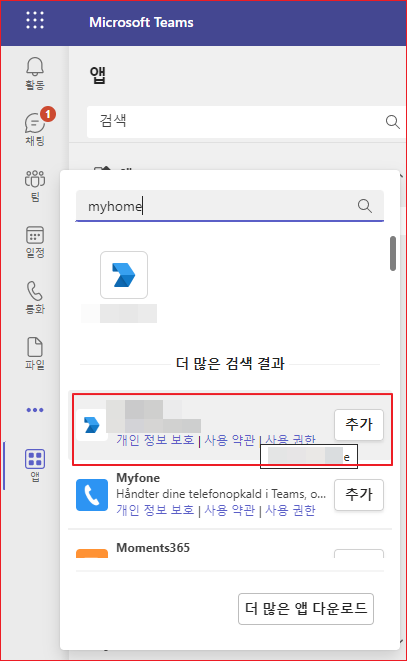
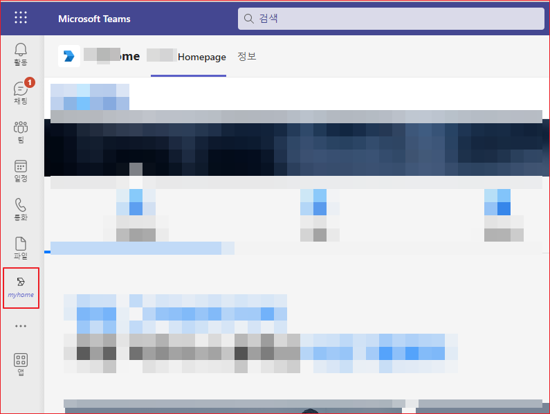

# 정적 탭 생성하기 

탭은 Microsoft Teams에 내장된 Teams가 알고 있는 웹페이지입니다. 앱 매니페스트에 선언된 도메인을 가리키는 간단한 HTML \<iframe\>태그입니다. team, group chat, 개별 사용자를 위한 개인 앱 내부에 채널의 일부로서 추가될 수 있습니다. 

Tab에는 두 가지가 있는데 하나는 [Static tabs이고 나머니는 Configurable tabs 입니다](https://blog.thoughtstuff.co.uk/2017/09/developing-with-microsoft-teams-creating-static-tabs/). 구성가능한 탭(Configurable tabs)는 다음 절에서 설명할 것입니다. 


## Teams App 구성 
앱을 배포하려면 zip 파일로 포함되어야 합니다. 그 안에 그것을 정의하는 중요한 파일이 많이 있습니다. 먼저 두 개의 이미지 파일이 있습니다. 팀 내에서 응용 프로그램을 식별하는 데 사용됩니다. 하나는 96제곱픽셀이고 다른 하나는 20픽셀제곱입니다. 앱을 사이드로드할 때 이 두 아이콘이 모두 있어야 합니다.  

둘째, manifest.json이라는 JSON 파일이 있습니다. 여기에는 애플리케이션에 대한 모든 정의 정보가 포함됩니다. 매니페스트에 포함해야 하는 필수 값이 많이 있습니다. 


## 정적 탭 
정적 탭을 만들려면 Teams 내에서 노출하려는 일부 웹 콘텐츠가 있어야 합니다. 이 콘텐츠는 모든 사용자에게 동일해야 합니다. (다른 사용자 또는 변화하는 상황에 따라 변경되는 콘텐츠가 필요한 경우 구성 가능한 탭이 필요합니다. 이 예제에서는 기존의 웹사이트를  사용할 것입니다. 

정적 탭을 나타내려면 manfiest.json 파일을 만들어야 합니다. 여기에 설명된 기본 템플릿으로 시작한 다음 정적 탭을 만들기 위한 특정 섹션을 추가합니다.

**manifest.json**    
```json
"staticTabs": [
    {
        "entityId": "pageid",
        "name": "ThoughtStuff Blog",
        "contentUrl": "https://yourdomain.com",
        "websiteUrl": "https://yourdomain.com",
        "scopes": [ "personal" ]
    }
 ],
"validDomains": [
    "*.yourdomain.com"
]
```

이 섹션의 속성 중 일부는 명백하지만 일부는 약간의 설명이 필요합니다.


* entityId - 탭의 고유 식별자입니다. 정적 탭의 경우 특정 역할을 수행하지 않습니다
* name - 팀에 표시하려는 페이지 이름
* contentUrl - 것은 실제로 렌더링되고 탭의 콘텐츠로 표시되는 URL입니다.
* websiteUrl - 이것이 'breakout' URL입니다. Teams에서 contentUrl이 렌더링되면 '웹사이트로 이동' 링크와 함께 페이지 상단에 아이콘이 표시됩니다. 사용자를 대체 환경으로 안내하거나 Teams에서 일반 페이지와 다르게 정보 형식을 지정하려는 경우, 이 링크에 대해 다른 URL을 지정할 수 있습니다. 
* scopes - Teams 클라이언트에서 탭이 표시되는 위치를 정의합니다. 현재 정적 탭에 대한 유일한 지원 범위는 '개인'입니다. 여기에 다른 범위를 추가할 수 있지만 아무 작업도 수행하지 않습니다.


위의 샘플에서 staticTab 섹션 옆에 validDomains 섹션인 또 다른 섹션이 있음을 알 수 있습니다. 이것은 여러 다른 개발 구현에서 사용됩니다.그러나 여기서는 contentUrl 또는 websiteUrl에서 참조하려는 도메인을 허용 목록에 추가하는 데 사용됩니다. 참조하는 모든 도메인이 이 목록에 있는지 확인하십시오. 쉼표를 사용하여 도메인을 구분합니다. 위의 예와 같이 하위 도메인에 와일드카드를 사용할 수 있습니다.

모든 URL은 HTTPS여야 합니다. http://로 시작하는 URL을 사용하는 경우 애플리케이션을 로드할 때 거부됩니다.


## 앱 생성

정적 탭을 만들 때 마이크로소프트가 제공하는 툴을 이용하여 개발할 수 있지만, 이 섹션에서는 Developer Portal을 사용하는 것으로 설명하겠습니다.

* [Developer Poratl](https://dev.teams.microsoft.com/apps)에서 "새 앱"을 선택합니다. 
* "앱 이름"의 "간단한 이름"과 "전체 이름"을 입력합니다. 
* "설명"의 "간단한 설명"과 "긴 설명"을 입력합니다. 
* 버전은 "1.0.0"초기값으로 둡니다. 
* "개발자 정보"의 "개발자 또는 회사 이름"을 입력하고 "웹사이트"를 입력합니다. 
* "앱 URL"에 "개인정보 취급방침"의 웹페이지 URL과 "사용약관"에 약관 페이지 URL을 입력합니다. 
* "저장"을 선택합니다. 
* "구성"의 "앱 기능"을 선택합니다. 
* "개인 앱"을 선택합니다. 
* "이름"에 앱의 이름을 입력합니다. 
* "컨텐츠 URL"에 내용이 뵤여질 컨텐츠 URL을 입력합니다. 이 URL이 실제 사용자에게 뵤여질 페이지입니다. 
* "웹사이트 URL"에 웹사이트 URL을 입력합니다.
* 저장을 선택합니다. 
* "게시"의 "앱패키지"를 선택합니다. 
* "매니페스트"를 선택합니다. 

아래과 같이 json 형식으로 내용이 나타날 것입니다. 직접 앱을 구성하는 것보다 Developer Portal을 사용하는 것이 편리합니다.

```json
{
  "$schema": "https://developer.microsoft.com/en-us/json-schemas/teams/v1.16/MicrosoftTeams.schema.json",
  "version": "1.0.1",
  "manifestVersion": "1.16",
  "id": "618390a1-0882-41c4-8195-e04e96bf5eec",
  "packageName": "com.package.name",
  "name": {
    "short": "myhome",
    "full": "My homepage"
  },
  "developer": {
    "name": "Yoursoft, Inc.",
    "mpnId": "",
    "websiteUrl": "https://www.yourdomain.com",
    "privacyUrl": "https://www.yourdomain.com/privacy",
    "termsOfUseUrl": "https://www.yourdomain.com/termofuse"
  },
  "description": {
    "short": "My Home page",
    "full": "My Home page"
  },
  "icons": {
    "outline": "outline.png",
    "color": "color.png"
  },
  "accentColor": "#FFFFFF",
  "staticTabs": [
    {
      "entityId": "75ad30ga-53d4-4910-a32b-70c846c858d3",
      "name": "Naon Homepage",
      "contentUrl": "https://www.yourdomain.com",
      "websiteUrl": "https://www.yourdomain.com",
      "scopes": [
        "personal"
      ]
    },
    {
      "entityId": "about",
      "scopes": [
        "personal"
      ]
    }
  ],
  "validDomains": []
}
```

* "게시"의 "조직에 게시"를 선택합니다. 
* "게시"를 선택합니다. 


## 앱 승인
 
[Microsoft Teams 관리 센터](https://admin.teams.microsoft.com/)를 브라우져에서 엽니다. 

* "팀즈 앱"을 선택하여 확장합니다. 
* "앱 관리"를 선택합니다. 
* 검색 항목에 앱이름을 입력합니다.  앱이 나타납니다. 
* 앱을 선택합니다. 
* "Publish"를 선택합니다. 




## 팀즈에서 앱 등록 


* 팁즈 앱에서 App bard의 더 보기 메뉴를 선택합니다. 
* 앱 이름을 입력합니다. 검색된 앱이 나타납니다. 
* "추가" 버튼을 클릭합니다. 



* 앱바에 추가된 정적 탭 앱이 표시됩니다. 
* 앱을 선택합니다. 오른쪽에 탭앱이 나타납니다. 


