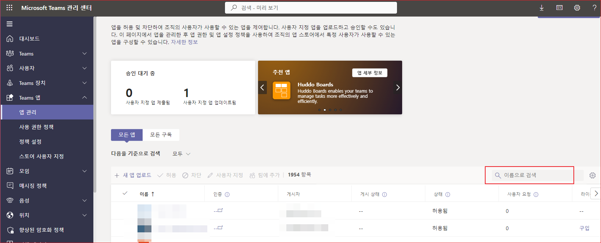

# 구성가능한 탭 생성하기


구성가능한 탭이라는 것은 사용자가 탭앱을 추가할 때 무엇인가를 구성할 수 있다는 말입니다. 예를들어 사용자가 탭앱을 추가할 때  red와 gray 옵션을 제공합니다.  사용자가 red를 선택하면 이후에 탭앱을 호출할 때에는  "https://yourdomain.com/red"로 호출하고, gray를 선택하면 이후에 탭앱을 호출할 때에는 "https://yourdomain.com/gray"로 호출합니다. 

'구성 가능' 탭은 공유용입니다. Teams 채널 및 그룹 채팅에서 실행됩니다. 아이디어는 한 그룹의 사람들이 구성을 공유한다는 것입니다.

정적 탭의 Teams 매니페스트에는 탭의 URL이 포함됩니다. 그러나 구성 가능한 탭의 경우 탭 구성 페이지의 URL이 포함됩니다. 구성 페이지에서 사용자는 탭에 표시되는 정보를 구성할 수 있습니다.


## App 등록하기

개발자 포털은 Teams 앱을 등록하는 다음 방법을 제공합니다. "2." 항목은 설명하지 않습니다. 
1. Create and register a brand new app.
2. Import an existing app package.


먼저 앱을 생성하겠습니다. [https://dev.teams.microsoft.com/home](https://dev.teams.microsoft.com/home)로 이동합니다. 

왼쪽 패널에서 "앱(Apps)"을 선택합니다. 


"새 앱"을 선택합니다. 


앱 이름을 입력하고 "추가"를 선택합니다. 


## 기본정보 

이제 새 앱을 성공적으로 만들었으며 새 앱의 모든 기본 정보를 볼 수 있습니다.


* 기본정보
    * 앱 이름 
        * 간단한 이름: 간단한 앱 이름을 입력합니다. 
        * 전체 이름: 긴 앱의 이름을 입력합니다.  
    * 앱 ID: 마이크로소프트가 자동으로 부여한 아이디입니다.
    * 설명
        * 간단한 설명 : 간단한 앱의 설명을 입력합니다. 
        * 긴 설명: 자세한 앱의 설명을 입력합니다. 
    * 버전 : 기본값 1.0.0 입니다. 
    * 개발자 정보
        * 개발자 또는 회사 이름: 회사 이름을 입력합니다. 
        * 웹 사이트: 회사의 웹사이트를 입력합니다. 
    * 앱 URL 
        * 개인 정보 취급 방침
        * 사용 약관
    * 응용 프로그램(클라이언트) ID: Azure Active Directory에 앱을 등록할 때 할당된 앱 ID를 지정합니다.
    * Microsoft 파트너 네트워크 ID : 마이크로소프트 파트너가 아니므로 비워 둡니다. 

## 브랜딩 
이 섹션에서는 .png 포맷으로 Color icon과 Outline icone을 추가할 수 있습니다. 


## 앱 기능(App features)
이 세션에서는 다음의 특징을 추가할 수 있습니다. 
* Personal app
* Bot
* Connector
* Scene
* Group and channel app
* Messaging extension
* Meeting extension
* Activity feed notification


"그룹 및 채널 앱"을 선택합니다. 


**구성 URL**    
Teams는 https 만 지원합니다. 로컬환경에서 https를 지원하기 위해서 ngrok를 사용합니다. ngrok는 https로 들어오는 요청을 로컬의 다른 포트로 연결해 줍니다.  /teams/teams-configuration 요청을 처리하는 페이지는 나중에 작성할 것입니다.  


**범위**   
팀과 그룹 채팅을 모두 선택합니다. 

**컨텍스트**    
드롭다운 박스를 클릭하여 chanelTab을 선택합니다. 

저장을 선택합니다. 


## 게시

게시 아래의 앱 패키지를 선택합니다. "매니페스트"를 선택합니다. 


아래와 같이 구성정보가 JSON 포맷으로 보여집니다. 

```json
{
  "$schema": "https://developer.microsoft.com/en-us/json-schemas/teams/v1.16/MicrosoftTeams.schema.json",
  "version": "1.0.0",
  "manifestVersion": "1.16",
  "id": "b2261514-9a03-4ff6-a5a6-5aa563dc9bde",
  "packageName": "com.package.name",
  "name": {
    "short": "Test Conent App",
    "full": ""
  },
  "developer": {
    "name": "",
    "mpnId": "",
    "websiteUrl": "",
    "privacyUrl": "",
    "termsOfUseUrl": ""
  },
  "description": {
    "short": "",
    "full": ""
  },
  "icons": {
    "outline": "outline.png",
    "color": "color.png"
  },
  "accentColor": "#FFFFFF",
  "configurableTabs": [
    {
      "configurationUrl": "https://92fe-1-214-255-114.jp.ngrok.io/teams/teams-configuration",
      "canUpdateConfiguration": false,
      "scopes": [
        "groupChat",
        "team"
      ],
      "context": [
        "channelTab"
      ]
    }
  ],
  "validDomains": [
    "92fe-1-214-255-114.jp.ngrok.io"
  ]
}
```

"조직에 게시"를 선택합니다. 앱을 처음 게시하므로 "앱게시"를 선택합니다. 


##  앱 승인
게시된 앱을 승인하기 위해서 [Microsoft Teams 관리센터](https://admin.teams.microsoft.com/dashboard)로 이동합니다. 

왼쪽 패널에서 "Teams 앱" 아래의 "앱 관리"를 선택합니다. 등록된 앱들이 보입니다.  오른 쪽 아래의 "이름으로 검색"에 "Test connent"를 입력하고 엔터를 누릅니다. 



검색된 앱이 표시됩니다.


검색된 앱 이름을 선택합니다. 앱 정보가 표시됩니다. "Publish"를 선택합니다. 


구성페이지가 표시됩니다. 


## 구성페이지 생성하기 
이제 사용자가 팀즈 앱에서 앱을 추가하면 표시될 구성 페이지를 작성해야 합니다.  TeamsServiceController.java를 생성하고 다음과 같이 입력합니다. 

```java
@Controller
@RequestMapping("/teams")
public class TeamsServiceController {
    @GetMapping("/teams-configuration")
    public String mytab(Model model) throws Exception {
        return "teams-configuration";
    }
}
```

tems-configuration.html을 다음과 같이 작성합니다. 이 페이지는 TeamsJS library를 참조해야 하고 app.initialize()를 호출해야 합니다. 


```html
<html lang="en">
<head>
    <title>Document</title>
    <script src="https://res.cdn.office.net/teams-js/2.0.0/js/MicrosoftTeams.min.js"
        integrity="sha384-QtTBFeFlfRDZBfwHJHYQp7MdLJ2C3sfAEB1Qpy+YblvjavBye+q87TELpTnvlXw4" crossorigin="anonymous">
        </script>    
</head>
<body>
    <h1>Configuration Page</h1>
    <script>
        window.addEventListener("load", function () {
            microsoftTeams.initialize();
        });
    </script>
</body>
</html>
```

## 사용자 구성 설정 
팀즈에 탭을 추가할 때 contentUrl을 이용하여 탭에 표시될 페이지를 호출하게 되는데 동일한 URL의 탭을 추가하는 것이 아니라 사용자 선택에 의해서 URL을 변경하여 저장해야 하는 경우가 많이 있습니다. 

예를 들어, 구성 페이지에서 사용자가 red 버튼을 선택하면 "https://yourWebsite.com/red"롤 content Url을 호출하고, 사용자가 gray 버튼을 선택하면 "https://yourWebsite.com/gray"로 content Url을 호출하도록 구성하여 탭을 추가하는 경우를 의미합니다. 


구성 페이지에 두 개의 버튼을 생성하고 버튼에 따라 다른 Content URL을 구성하여 탭을 생성하도록 코드를 작성합니다. 
```html

    <script>
        // flow 
        // 사용자 탭추가 -> 구성 URL 호출 -> popup 호출 -> notifySuccess() 호출 -> contentUrl 호출(redirect)
        window.addEventListener("load", function () {
            // 초기화 
            microsoftTeams.initialize();


            let saveGray = () => {
                microsoftTeams.pages.config.registerOnSaveHandler((saveEvent) => {
                    // contentUrl에 gray를 붙인다. 
                    const configPromise = pages.config.setConfig({
                        websiteUrl: "https://yourWebsite.com",
                        contentUrl: "https://yourWebsite.com/gray",
                        entityId: "grayIconTab",
                        suggestedDisplayName: "MyNewTab"
                    });
                    configPromise.
                        then((result) => { saveEvent.notifySuccess() }).
                        catch((error) => { saveEvent.notifyFailure("failure message") });
                });
            }

            let saveRed = () => {
                microsoftTeams.pages.config.registerOnSaveHandler((saveEvent) => {
                    // contentUrl에 red를 붙인다. 
                    const configPromise = pages.config.setConfig({
                        websiteUrl: "https://yourWebsite.com",
                        contentUrl: "https://yourWebsite.com/red",
                        entityId: "redIconTab",
                        suggestedDisplayName: "MyNewTab"
                    });
                    configPromise.
                        then((result) => { saveEvent.notifySuccess(); }).
                        catch((error) => { saveEvent.notifyFailure("failure message") });
                });
            }

            window.document.querySelector("#btnGray").addEventListener("click", function () {
                // 사용자가 무엇인가를 선택하고 구성을 완료했다고 가정하고 다음을 호출 
                microsoftTeams.pages.config.setValidityState(true);
                saveGray();
            });
            window.document.querySelector("#btnRed").addEventListener("click", function () {
                // 사용자가 무엇인가를 선택하고 구성을 완료했다고 가정하고 다음을 호출 
                microsoftTeams.pages.config.setValidityState(true);
                saveRed();
            });

        });

    </script>
```

사용자가 버튼을 선택하면 구성을 완료했다고 가정하고 microsoftTeams.pages.config.setValidityState(true);을 호출합니다. 그러면 registerOnSaveHandler()가 트리거 됩니다. 

구성 페이지 코드는 팀에 구성 요구 사항이 충족되었으며 설치를 진행할 수 있음을 알립니다. 사용자가 저장을 선택하면 Config 인터페이스에서 정의한 대로 pages.config.setConfig()의 매개변수가 설정됩니다. saveEvent.notifySuccess()가 호출되어 콘텐츠 URL이 성공적으로 확인되었음을 나타냅니다. entityId는 중복되지 않는 유니크한 값이어야 합니다. 

> 채널 또는 그룹 탭이 Teams 모바일 클라이언트에 표시되도록 선택한 경우 setConfig() 구성에 websiteUrl에 대한 값이 있어야 합니다.


## 탭 추가 
Teams app에서 채널을 선택하고 앱추가(+) 버튼을 클릭합니다. 


"검색"을 클릭한 다음, "Test Con"을 입력하고 검색된 앱을 클릭합니다. 


## 참고

[Create a configuration page](https://learn.microsoft.com/en-us/microsoftteams/platform/tabs/how-to/create-tab-pages/configuration-page?tabs=teamsjs-v2)    
[Developer Portal for Teams](https://learn.microsoft.com/en-us/microsoftteams/platform/concepts/build-and-test/teams-developer-portal)    
[Build tabs for Teams](https://learn.microsoft.com/en-us/microsoftteams/platform/tabs/what-are-tabs)    
[Add a Configurable Tab](https://microsoft.github.io/app-camp/aad/ConfigurableTab/#features) 

