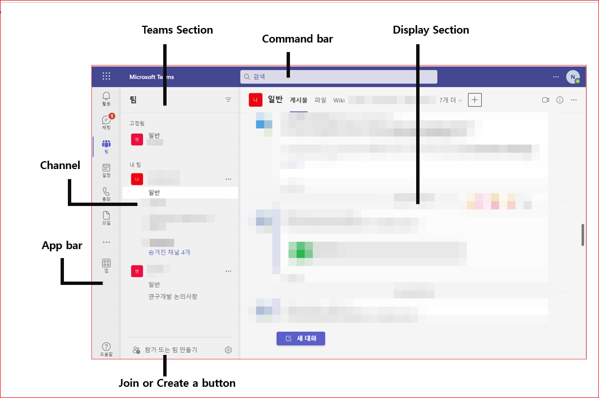
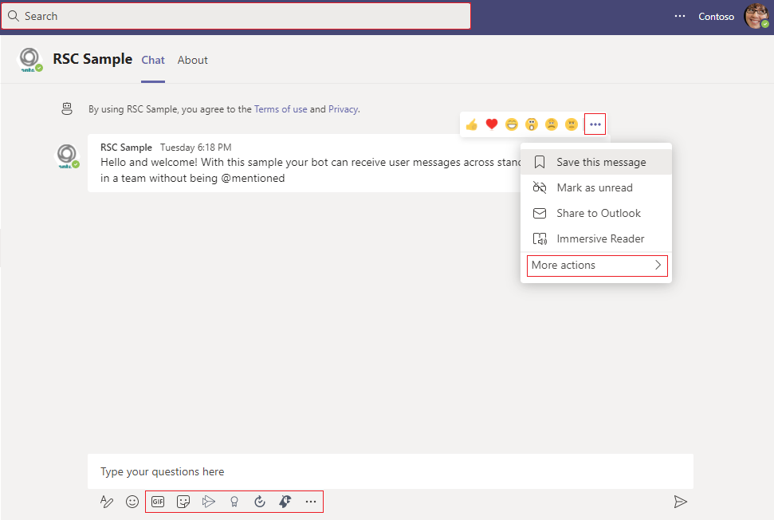

# 팀즈를 위한 앱 개발 

Microsoft Teams는 Microsoft 또는 외부 서비스에 의해 제공되는 apps의 컬렉션을 제공합니다. 이 책에서는 그 중에서도 Tab이라고 불리우는 웹앱을 개발하는 방법을 설명합니다. 탭앱을 이용하면 기존에 존재하는 웹앱을 팀즈에 임베드할 수 있습니다. 탭은 Teams Toolkit을 이용하거나 외부 서비스를 Developer Portal에서 생성하는 방법이 있습니다. 이 책에서는 Teams Developer Portal에서 생성하는 방법을 설명합니다. 이 장에서는 우선 탭앱을 추가하는 방법만을 설명합니다.  봇, 메시지 확장 등 다른 기능들은 차후 보완할 예정입니다. 

이 장을 통하여 다음을 학습할 수 있습니다. 

* [정적탭 생성하기](01.static-tab.md) - 기존의 웹앱을 팀즈 탭에 추가 
* [구성가능한 탭 생성하기](02.configurable-tabs.md) - 사용자가 조건을 선택하여 기존의 웹앱을 팀즈 탭에 추가 
  * 예를 들어, 두 가지 옵션 red와 gray를 제공하고 
    * 사용자가 red를 선택하면 http://yourdomain.com/red로 호출 
    * 사용자가 gray를 선택하면 http://yourdomain.com/gray로 호출하도록 구성 
* [Tab app에서 SSO 사용하기](03.sso.md) - Teams와 기존의 웹앱을 SSO 처리 
* [Graph API 사용](04.graph-api.md) - Teams로부터 Auth Token을 구하여 사용자를 대신하여 Graph API를 호출 


## Teams UI
Tab을 개발하기 전에 Teams UI를 살펴 보겠습니다. Teams UI는 다음과 같습니다. 1




**app bar**   
App bar에는 고정앱이라고 불리우는 마이크로 소프트가 제공하는 기본 앱들이 배치되어 있습니다. 

* 채팅은 개인간의 채팅 또는 그룹 채팅의 목록이 표시됩니다. 
* 팀은 사용자가 속한 팀의 목록을 표시합니다. 임의의 팀을 확장하면 팀의 채널들이 표시됩니다. 
  * 채널을 선택하여 "+" 버튼을 선택하면 채널에 디폴트로 보인은 "게시물", "파일" 이외에 다른 앱들을 추가할 수 있습니다.


**personal tab**     
왼쪽 패널을 보면 App bar가 있습니다. 단일 유저에게 한정된 개인 앱들의 일부로서 퍼스널 탭들이 있는데, 접근을 쉽게하기 위해 앱바에 고정될 수 있습니다. 즉, 개인앱을 추가하면 App bar에 아이콘으로 추가됩니다. 

**channel tab**     
Command bar 아래의 메뉴의 오른쪽에 "+" 버튼이 있습니다. 이 버튼을 선택하여 앱을 추가하면 채널에 앱이 추가됩니다. Channel 또는 Group 탭들이 여기에 추가됩니다. 


## 로그인할 사이트

Teams Tab Apps를 개발하기 위해서는 다음 사이트에 모두 로그인 해야 합니다. 

* [Teams Developer Portal](https://dev.teams.microsoft.com/home) - Tab App를 여기서 생성합니다.     
* [Microsoft Teams 관리센터](https://admin.teams.microsoft.com/dashboard) - 생성된 Tab App을 여기서 Publish합니다.     
* [Azure Portal App Registrations](https://portal.azure.com/#view/Microsoft_AAD_IAM/ActiveDirectoryMenuBlade/~/RegisteredApps)  - Graph API를 사용하거나 Tab App에 SSO가 가능하도록 합니다. 
* [Microsoft 365 Admin Console](https://admin.microsoft.com/) - M365 사용자 및 조직을 관리합니다.    


이 아래부터는 팀즈를 이해하기 위하여 읽어 두세요. 

## 앱 기능

Teams 앱에는 다음 기능 중 하나 이상이 포함됩니다. 

* 봇 : 봇을 챗봇 또는 대화형 봇이라고도 합니다. 간단하고 반복적인 작업을 실행하는 앱
* 탭 : 탭은 채널 또는 채팅의 맨 위에 고정된 Teams 인식 웹 페이지
* 웹후크 및 커넥터: 웹후크 및 커넥터는 다양한 웹 서비스를 Microsoft Teams의 채널 및 팀에 연결
* 메시지 확장 : 메시징 확장은 앱 콘텐츠를 삽입하거나 최종 사용자가 대화에서 벗어나지 않고도 메시지에 대해 작업하는 바로 가기
* 모임확장, 활동 피드


## 개발 전 알아 두어야할 

참고로 Teams 앱을 개발하기 전에 Teams에 대해서 알아야 할 내용은 다음과 같습니다. 

* Microsoft 365에는 두 가지 유형의 그룹이 있음
  * Microsoft Teams 관리센터에서 추가하는 Team 
    * Teams 관리 센터에서 추가한 팀은 팀즈 앱의 Teams 탭에서 표시됌  
  * Microsoft 365 관리 센터에서 추가하는 그룹 
    * Teams에서 추가된 팀은 Microsoft 365 관리 센터에서 "팀 상태"에 팀즈 아이콘이 표시 됌 
* 팀즈 앱 
  * 고정 앱 : 활동 피드, 팀, 채팅, 일정, 통화 , 파일 및 할당 
    * 최종 사용자가 쉽게 엑세스할 수 있도록 기본적으로 고정 
    * 관리자는 정책 설정을 사용하여 이러한 기본 동작을 수정할 수 있음
    * 고정앱은 팀즈 앱에서 좌측 앱바(Appbar)라는 곳에 고정됨  
  * 타사 앱 
    * Microsoft에서 제공하는 앱 외에도 타사 앱을 사용할 수 있음
    * 사용자는 Teams 앱 스토어에서 앱을 찾아 추가할 수 있음 
* 앱 기능 
  * 앱에는 다음 기능 중 하나 이상이 포함
    * 봇 : 봇을 챗봇 또는 대화형 봇이라고도 합니다. 간단하고 반복적인 작업을 실행하는 앱
    * 탭 : 탭은 채널 또는 채팅의 맨 위에 고정된 Teams 인식 웹 페이지
    * 웹후크 및 커넥터: 웹후크 및 커넥터는 다양한 웹 서비스를 Microsoft Teams의 채널 및 팀에 연결
    * 메시지 확장 : 메시징 확장은 앱 콘텐츠를 삽입하거나 최종 사용자가 대화에서 벗어나지 않고도 메시지에 대해 작업하는 바로 가기
    * 모임확장, 활동 피드 
* Teams의 Teams 및 채널 
  * Teams는 초대된 사용자만 비공개로 구성가능 
  * Teams는 모두에게 공개되되도록 구성 가능
  * Teams는 클라이언트에서도 등록 가능   
  * 채널은 대화를 정리하는 팀의 전용 섹션
    * 파일 탭에서 채널을 통해 공유되는 파일은 SharePoint에 저장됨 
  * Teams앱에는 엑세스 가능한 팀즈가 표시됨 
    * 팀즈를 클릭하면 팀즈의 채널이 표시됨
    * 채널에는 앱을 추가할 수 있음
    * General이 디폴트 채널임 
* Chat    
  * New Chat를 선택하면, 이름, 이메일, 그룹을 선택하여 채팅을 시작할 수 있음
  * Chat에도 앱을 추가할 수 있음 
* Teams 앱 
  * 앱은 webpage임 
  * 팀즈 앱은 팀즈 관리자 사이트에서 등록 가능      
  * 앱을 생성하여 팀즈 관리센터에서 등록하면 팀즈앱에서 탭을 생성하면서 앱을 선택할 수 있음  
* Graph API를 이용하여 대화방에 대화 전송, 채널 생성 등은 Microsof Azure 관리자 사이트에서 앱을 등록해야 함(구글의 클라우드 콘솔과 같은 것으로 생각하면 됌)
* 팀즈의 팀(team)을 생성하려면 Teams Teams 관리센터에서 팀을 생성해야 함. 


**Tabs**     
Tabs는 Microsoft Teams에 내장된 팀즈가 알고 있는 webpages입니다. team, group chat 또는 개인 app의 내부에 채널의 일부로서 추가할 수 있습니다. 

**Bots**    
봇은 챗봇 또는 대화형 봇이라고도 합니다. 사용자가 수행하는 단순하고 반복적인 자동화 작업을 실행하는 앱입니다.

고객 서비스나 지원 직원과 같은 사용자가 단순하고 반복적인 작업을 실행하는 앱입니다. 봇의 일상적인 사용에는 날씨 정보 제공, 저녁 식사 예약 또는 여행 정보 제공 봇이 포함됩니다. 봇과의 상호 작용은 빠른 질문과 답변 또는 복잡한 대화가 될 수 있습니다.


대화형 봇을 통해 사용자는 텍스트, 대화형 카드 및 작업 모듈을 사용하여 웹 서비스와 상호 작용할 수 있습니다.


```shell
Here is what I found

How do I start a private chat with a bot?

    +------------------+ +-----------------+
    |  Ask an expert   | | Share feedback  |
    +------------------+ +-----------------+
```


**Message extension**     
Message extensions는 당신의 web service Teams client와 사용자가 상호작용할 수 있도록 합니다. 그것들은 외부 시스템명세서 검색하거나 actions을 시작합니다. 

다음 이미지는 메시지 확장이 호출되는 위치를 표시합니다.





**Webhooks and connectors**     
Webhook 및 커넥터는 웹 서비스를 Microsoft Teams의 채널 및 팀에 연결하는 데 도움이 됩니다. Webhook은 Teams 채널에서 발생한 모든 작업에 대해 사용자에게 알리는 사용자 정의 HTTP 콜백입니다.앱이 실시간 데이터를 얻는 방법입니다. 커넥터를 사용하면 사용자가 웹 서비스에서 알림 및 메시지를 수신하도록 구독할 수 있습니다.카드 형식으로 메시지를 게시하기 위해 서비스에 대한 HTTPS 끝점을 노출합니다.


**Outging Webhooks**     
Webhook는 Teams가 외부 앱과 통합하는 데 도움이 됩니다. 발신 웹후크를 사용하면 채널에문자나 카드로 메시지에 10초 이내로 응답하는 서비스입니다.서 웹 서비스로 문자 메시지를 보낼 수 있습니다. 발신 웹후크를 구성한 후 사용자는 발신 웹후크를 @멘션하고 웹 서비스에 메시지를 보낼 수 있습니다. 문자나 카드로 메시지에 10초 이내로 응답하는 서비스입니다.


**Incoming Webhooks**     
수신 Webhook는 앱에서 Teams로 메시지를 게시하는 데 도움이 됩니다. 모든 채널의 팀에 대해 수신 Webhook가 활성화된 경우 올바른 형식의 JSON을 수락하고 해당 채널에 메시지를 삽입하는 HTTPS 끝점을 노출합니다. 예를 들어 DevOps 채널에서 수신 Webhook를 생성하고, 빌드를 구성하고, 서비스를 동시에 배포 및 모니터링하여 알림을 보낼 수 있습니다.

**Cards**     
카드는 짧거나 관련된 정보를 위한 사용자 인터페이스(UI) 컨테이너입니다. 카드에는 여러 속성과 첨부 파일이 있을 수 있으며 카드 작업을 트리거하는 버튼이 포함될 수 있습니다. 카드를 사용하면 정보를 그룹으로 구성하고 사용자가 정보의 특정 부분과 상호 작용할 수 있는 기회를 제공할 수 있습니다.


자세한 사항은 [Microsoft Teams developer documentation](https://learn.microsoft.com/en-us/microsoftteams/platform/mstdd-landing)을 참고합니다. 


## Authenticate users in Microsoft Teams 

다음 두 가지 방법 중 하나로 앱에 대한 인증을 추가하도록 선택합니다.

* **Enable single sign-on (SSO) in a Teams app** - Teams 내부의 SSO는 사용자들이 당신의 앱에 접근하도록 제공하깅 위한 앱 사용자의 신원을 사용하는 인증 방법입니다.  한 번의 동의만으로 다시 로그인할 필요가 없습니다. 

* **Enable authentication using third-party OAuth provider** -  써드 파티 Oauth Identity Provider(IdP)를 사용자를 인증하기 위해서 사용할 수 있습니다.  Azure는 그런 써드 파티 OAuth 프로바이더의 하나이고 Google, Facebook, Github 등, 어떤 것이던 사용할 수 있습니다. 


